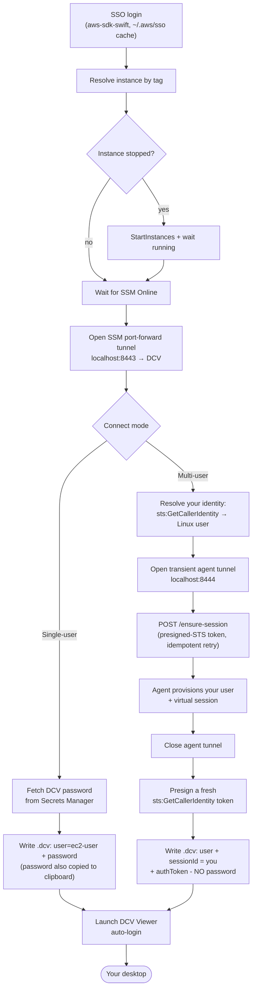

# SSM Connect

> [!NOTE]
> Config-driven macOS menu-bar app that gets you into your cloud workstation with one click - as the shared `ec2-user`, **or as your own AWS identity**.

**SSM Connect** is a native macOS (Swift / SwiftUI) menu-bar utility that automates the whole
"connect to an EC2 workstation over AWS SSM" dance: AWS SSO authentication, instance discovery by
tag, instance start + SSM-readiness wait, an SSM port-forward tunnel, and launching the viewer
(Amazon DCV by default) - with **zero manual terminal commands**.

It drives two kinds of host:

- a **single-user** box (vanilla `ec2-user` + a DCV password), and
- a **multi-user** box where each person lands in their **own isolated desktop**, authenticated by
  their **own AWS IAM Identity Center (SSO) identity** - no per-user passwords. The on-box half of
  that is the companion [`dcv-session-agent`](https://github.com/vhco-pro/dcv-session-agent).

Nothing is hardcoded. A connection is a **config-driven profile** (AWS account, SSO start URL,
SSO region, resource region, instance tag, connect mode, ports, and either a secret id or an agent
port), so the same app can drive **any** SSM-reachable EC2 workstation. On first launch you import
a profile from your `~/.aws/config`; you can keep multiple named profiles.

## The two connect modes

A profile's **connect mode** decides the path. Existing/legacy profiles default to **single-user**,
so nothing changes unless you opt in.

|  | **Single-user** (vanilla, default) | **Multi-user** |
|---|---|---|
| You log in as | the shared **`ec2-user`** | **your own** SSO identity (e.g. `dl6544-a`) |
| DCV session | the host's one **console** session | a **per-user virtual** session, created on demand |
| Authentication | a **DCV password** from Secrets Manager | a **presigned `sts:GetCallerIdentity`** identity token - **no password** |
| Isolation | everyone shares one desktop | each user gets their **own** desktop + home |
| Profile fields | `secretId` (the password secret) | `connectMode = multiUser`, `agentRemotePort` (default `8444`) |
| Extra AWS permission | `secretsmanager:GetSecretValue` | none - it proves *your own* identity |

### Dependencies per mode

**Single-user** needs:
- the workstation deployed in **vanilla/console** mode (`ec2-user`), and
- a **Secrets Manager** secret holding the `ec2-user` DCV password (its id goes in the profile).

**Multi-user** needs:
- the [`dcv-session-agent`](https://github.com/vhco-pro/dcv-session-agent) running on the host,
  listening on loopback `:8444`, and
- DCV configured for **virtual sessions + external token auth** (`create-session=false` +
  `auth-token-verifier`), which the agent's bootstrap sets up.
- No password, no broker, no web portal. The agent provisions your Linux user + virtual session on
  first connect.

> [!IMPORTANT]
> A multi-user host is **identity-only** - there is no `ec2-user`/shared fallback on it. Keep a
> separate single-user profile if you also have a vanilla box.

## Install

```bash
brew install --cask vhco-pro/tap/ssm-connect
```

The app is **ad-hoc signed (not notarized)**, so on first launch macOS Gatekeeper will block it.
Approve it once with either:

```bash
xattr -dr com.apple.quarantine "/Applications/SSMConnect.app"
```

…or right-click **SSMConnect.app** in Finder → **Open**. Updates ship through `brew upgrade`.

## First launch

The app starts with **no profile** - nothing about any AWS environment is baked in.

1. Click the menu-bar icon → **Set Up a Workstation…** (opens Settings → Profiles).
2. Click **Import from `~/.aws/config`** and pick the profile for your workstation. The SSO start
   URL, SSO region, account, role, and resource region are filled in for you.
3. Set the **instance tag value** (e.g. `Name = my-workstation`) and pick the **Connect mode**:
   - **Single-user** → also set the **DCV password secret id**.
   - **Multi-user** → set the **agent port** (default `8444`); no secret needed.
4. **Save**, then **Connect**. With auto-connect enabled, it connects on launch/login from then on.

## Requirements

- macOS 14 (Sonoma) or later, Apple Silicon
- [Amazon DCV Viewer](https://www.amazondcv.com) (for the default DCV connect action):
  `brew install --cask dcv-viewer`
- An AWS account reachable via IAM Identity Center (SSO), and an EC2 workstation registered with SSM
- Network access to AWS endpoints (directly or via VPN)

IAM permissions the app needs (whatever your SSO role provides): `ec2:DescribeInstances`,
`ec2:StartInstances`, `ec2:StopInstances`, `ssm:DescribeInstanceInformation`, `ssm:StartSession`,
`ssm:TerminateSession`. **Single-user** mode additionally needs `secretsmanager:GetSecretValue`;
**multi-user** mode needs nothing extra (it re-uses your own `sts:GetCallerIdentity`).

## How it works

Both modes share the front half (auth → discover → tunnel), then branch:



In multi-user mode the agent tunnel is **transient** - it's only needed for the one
`/ensure-session` call; DCV reaches its token verifier locally on the box, not through the client,
so the agent tunnel is torn down before the viewer launches. The `.dcv` file is short-lived (`0600`)
and deleted right after the viewer opens.

- **Auth, EC2, SSM, Secrets Manager, STS** use the native
  [`aws-sdk-swift`](https://github.com/awslabs/aws-sdk-swift). SSO tokens use the standard
  `~/.aws/sso/cache` (shared with the AWS CLI), so logins are reused and silently refreshed.
- **The tunnel** reuses the official AWS `session-manager-plugin` binary, bundled in the app behind a
  `TunnelProvider` protocol (the SDK only exposes `StartSession`; the port-forward data-channel
  protocol lives only in the plugin). The plugin is fetched + checksum-verified at build time.
- **The identity token** (multi-user) is a presigned `sts:GetCallerIdentity` request used as an
  opaque bearer token - the same credential the SSM tunnel already required. The agent proves your
  identity by re-executing it against STS. A fresh token is minted per attempt to avoid expiry.

Security: no secrets are written to UserDefaults or Keychain; the only disk touch is the transient
`.dcv` file. No inbound security-group rules are ever suggested - all traffic is outbound over the
SSM tunnel.

## Development

The Xcode project is generated from `project.yml` via [XcodeGen](https://github.com/yonaskolb/XcodeGen)
(the generated `.xcodeproj` is gitignored - always regenerate).

```bash
brew install xcodegen
make run      # regenerate, build, launch the menu-bar app
make test     # run the Swift Testing suite
make rebuild  # clean build + launch
```

The first build downloads `session-manager-plugin` (pinned + SHA-256 verified) from AWS.

### Releasing

```bash
./scripts/release.sh   # Release build -> dist/SSMConnect-<version>.zip + sha256
```

Upload the zip as the GitHub release asset. The Homebrew cask
(`vhco-pro/homebrew-tap` → `Casks/ssm-connect.rb`) **auto-syncs** to the latest release version +
sha256 via a scheduled workflow in that tap (no manual cask edit needed).

### Notarization (upgrade path)

The app is ad-hoc signed for personal/Homebrew distribution. To remove all Gatekeeper friction for
wider distribution, enroll in the Apple Developer Program, obtain a *Developer ID Application*
certificate, sign the app + plugin with `--options=runtime` (Hardened Runtime), then
`xcrun notarytool submit … --wait` and `xcrun stapler staple`. No code changes are required - only
the signing/release pipeline.

## License

[Apache License 2.0](LICENSE). The bundled `session-manager-plugin` is also Apache 2.0
([aws/session-manager-plugin](https://github.com/aws/session-manager-plugin)); its license is
included in the app bundle.
