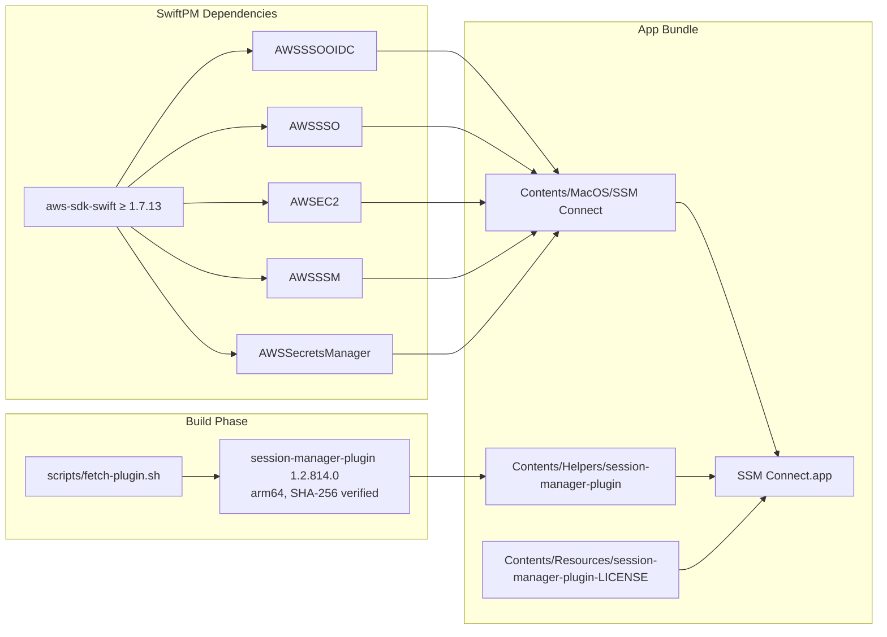
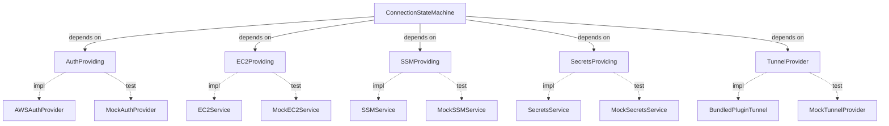

# Plan: SSM Connect — macOS Menu-Bar App

Implementation plan for the SSM Connect native macOS menu-bar app. Translates the spec (`docs/specs/ssm-connect.spec.md` v1.2) into phased, independently verifiable work with full requirement traceability. Follows the spec's §12 suggested implementation order with adjustments to retire risk earlier and separate concerns.

## Context

The manual runbook for connecting to the EC2 + DCV cloud workstation requires AWS CLI v2, `aws sso login`, instance-ID lookups, `aws ssm start-session` with port-forward docs, Secrets Manager password retrieval, and manual DCV Viewer launch. SSM Connect collapses this into a single menu-bar icon with auto-connect on login.

The spec is complete (v1.2, status "ready for planner"). All ADRs (1–7) are accepted. The critical risk — `aws-sdk-swift` SSO-OIDC API surface maturity — was de-risked via a compilation spike (sdk 1.7.13, Build complete 101s). No application code exists yet; the repo contains only the spec, README, and `.gitignore`.

**References:**
- Spec: `docs/specs/ssm-connect.spec.md`
- Spike findings: spec §12.1
- Companion server-side spec: `ec2-cloud-workstation-dcv.spec.md` (in the `one-b2c` workspace)

## Scope

### In Scope

- Xcode project creation and SwiftPM dependency setup
- Full 8-state connection state machine
- AWS SSO-OIDC auth with token cache reuse + silent refresh (F-04, F-05)
- EC2 instance discovery by tag, start, stop (F-06, F-07, F-15)
- SSM readiness polling + StartSession (F-08, F-09)
- Bundled `session-manager-plugin` tunnel with lifecycle management (F-09, F-13, ADR-1, ADR-7)
- DCV Viewer detection + launch (F-10, F-16)
- Secrets Manager password fetch + clipboard copy (F-11, NF-03)
- Menu-bar UI with state icons, status display, actions (F-01, F-12, F-14)
- Login item registration (F-02)
- Settings UI with multi-profile management (F-18, ADR-5)
- First-launch config seeder from `~/.aws/config` (sso-session block format)
- Notifications and connection log (F-19, F-20)
- Auto-connect and auto-reconnect (F-03, F-13)
- SSO expiry mid-session handling (F-17)
- Ad-hoc code signing and Homebrew tap cask packaging (ADR-4, ADR-6, NF-06)
- Build-time plugin fetch + checksum verification (ADR-7)
- Test suite (unit + mock-integration)

### Out of Scope

- Server-side infrastructure / Terraform (separate spec)
- Replacing DCV Viewer (the app orchestrates it, not replaces it)
- Non-DCV connect targets (RDP/VNC/SSH) — architecture supports it, v1 ships DCV only
- Windows / Linux / iOS clients
- Paid Apple Developer account / notarization (documented upgrade path only)
- In-app auto-updater (Sparkle) — updates via `brew upgrade`
- VPN management
- Password rotation or generation
- Intel (x86_64) universal binary — arm64 only for v1

## Design

### Project Layout (ADR-P1)

```
ssm-connect/                          # repo root
├── SSMConnect.xcodeproj/             # (new) Xcode project
├── SSMConnect/                       # (new) app source
│   ├── App/
│   │   └── SSMConnectApp.swift       # @main, MenuBarExtra, SwiftUI App lifecycle
│   ├── StateMachine/
│   │   ├── ConnectionState.swift     # 8-state enum
│   │   └── ConnectionStateMachine.swift  # @Observable, drives state transitions
│   ├── Services/
│   │   ├── Protocols/
│   │   │   ├── AuthProviding.swift   # protocol for SSO auth
│   │   │   ├── EC2Providing.swift    # protocol for EC2 ops
│   │   │   ├── SSMProviding.swift    # protocol for SSM ops
│   │   │   └── SecretsProviding.swift # protocol for Secrets Manager
│   │   ├── AWSAuthProvider.swift     # SSO-OIDC impl
│   │   ├── SSOCacheReader.swift      # ~/.aws/sso/cache parser
│   │   ├── EC2Service.swift
│   │   ├── SSMService.swift
│   │   └── SecretsService.swift
│   ├── Tunnel/
│   │   ├── TunnelProvider.swift      # protocol (from spec §6.2)
│   │   ├── TunnelHandle.swift        # protocol (from spec §6.2)
│   │   └── BundledPluginTunnel.swift  # exec session-manager-plugin
│   ├── Config/
│   │   ├── ConnectionProfile.swift   # Codable model
│   │   ├── AppSettings.swift         # global settings model
│   │   ├── ProfileStore.swift        # UserDefaults persistence
│   │   └── AWSConfigParser.swift     # ~/.aws/config + sso-session parser
│   ├── UI/
│   │   ├── MenuBarView.swift         # menu dropdown content
│   │   ├── SettingsView.swift        # settings window
│   │   ├── ProfileEditorView.swift   # add/edit profile
│   │   └── LogView.swift             # connection log window
│   ├── Utilities/
│   │   ├── RingBuffer.swift          # in-memory log buffer
│   │   └── ClipboardManager.swift    # copy + timed clear
│   ├── Resources/
│   │   └── session-manager-plugin-LICENSE  # Apache 2.0
│   └── Info.plist                    # LSUIElement=true, bundle id
├── SSMConnectTests/                  # (new) test target
│   ├── StateMachine/
│   │   └── ConnectionStateMachineTests.swift
│   ├── Services/
│   │   ├── AWSAuthProviderTests.swift
│   │   ├── SSOCacheReaderTests.swift
│   │   ├── EC2ServiceTests.swift
│   │   └── SSMServiceTests.swift
│   ├── Tunnel/
│   │   └── BundledPluginTunnelTests.swift
│   ├── Config/
│   │   ├── AWSConfigParserTests.swift
│   │   ├── ConnectionProfileTests.swift
│   │   └── ProfileStoreTests.swift
│   └── Mocks/
│       ├── MockAuthProvider.swift
│       ├── MockEC2Service.swift
│       ├── MockSSMService.swift
│       ├── MockSecretsService.swift
│       └── MockTunnelProvider.swift
├── scripts/                          # (new) build support
│   └── fetch-plugin.sh              # download + verify plugin
├── docs/
│   ├── specs/
│   │   └── ssm-connect.spec.md      # (existing — DO NOT MODIFY)
│   └── plans/
│       └── ssm-connect.plan.md      # this file
└── README.md                        # (existing)
```

### Dependency Graph (Build-Time)



### Service Layer — Protocol-Based DI

All AWS service interactions and the tunnel mechanism sit behind protocols. The state machine depends on protocols only, enabling mock injection for testing.



### Developer Tooling

Local build/run/test is driven by `scripts/run.sh` (zsh) with a thin `Makefile` wrapper:

| Command | Action |
|---------|--------|
| `make run` | Regenerate the Xcode project (XcodeGen), incremental build, launch the menu-bar app |
| `make rebuild` | Wipe build products, full rebuild + launch (`run.sh --clean`) |
| `make test` | Run the Swift Testing suite (`run.sh --test`) |
| `make generate` | Regenerate `SSMConnect.xcodeproj` from `project.yml` only |
| `make clean` | Remove build products (no rebuild) |

All `xcodebuild` invocations pass `-destination 'platform=macOS,arch=arm64'`, `-derivedDataPath .build/DerivedData`, and the required `-skipPackagePluginValidation` (smithy-swift ships a SwiftPM build-tool plugin). The script `pkill`s any running instance before relaunch.

## Acceptance Criteria

Every criterion traces to one or more spec requirement IDs. Criteria are independently testable.

- [ ] **AC-01** (F-01, F-12): App runs as a menu-bar-only app (no Dock icon). Clicking the icon shows a dropdown with connection state, instance ID, tunnel PID, local port, and elapsed time
- [ ] **AC-02** (F-02): "Launch at Login" toggle in Settings registers/unregisters via `SMAppService.mainApp`; visible in System Settings → Login Items
- [ ] **AC-03** (F-03): With auto-connect enabled and a valid SSO cache token, app launch completes the full connection flow without user interaction
- [ ] **AC-04** (F-04): With no valid SSO token, the app opens the default browser to the SSO authorization page, polls `CreateToken` with `device_code` grant, and obtains STS credentials on user approval
- [ ] **AC-05** (F-05): With an expired `accessToken` but valid `refreshToken` in `~/.aws/sso/cache/*.json`, the app refreshes silently via `CreateToken grant_type=refresh_token` without opening a browser
- [ ] **AC-06** (F-06): App resolves the instance ID by the configured tag (`EC2.DescribeInstances`); shows an error if zero or multiple matches
- [ ] **AC-07** (F-07): When the instance is `stopped`, app calls `EC2.StartInstances`, polls until `running` (5s interval, 5min timeout), and shows "Starting instance…"
- [ ] **AC-08** (F-08): App polls `SSM.DescribeInstanceInformation` until `PingStatus=Online` (5s interval, 3min timeout) before opening the tunnel
- [ ] **AC-09** (F-09, NF-13): App calls `SSM.StartSession`, passes response to the bundled `session-manager-plugin` via `Process`, and `localhost:<localPort>` accepts TCP connections forwarding to instance port 8443
- [ ] **AC-10** (F-10, F-16): App detects DCV Viewer presence; if found, launches it at `https://localhost:<localPort>`; if missing, shows install instructions without failing the tunnel
- [ ] **AC-11** (F-11, NF-01, NF-03): App fetches DCV password from Secrets Manager, shows it masked in the menu, copies to clipboard on button click, and optionally clears clipboard after configurable delay. Password is never on disk
- [ ] **AC-12** (F-13): When the plugin process exits unexpectedly, auto-reconnect retries up to 3 times with 5s backoff. On app quit, no orphaned `session-manager-plugin` processes remain (`SIGTERM` → wait 5s → `SIGKILL`)
- [ ] **AC-13** (F-14): "Reconnect" tears down the tunnel, re-resolves the instance by tag, and re-runs the full flow
- [ ] **AC-14** (F-15): "Stop Workstation" (with confirmation) calls `EC2.StopInstances` and transitions to Disconnected
- [ ] **AC-15** (F-17): On `ExpiredTokenException` mid-session, app re-triggers SSO auth and resumes without tearing down the active tunnel
- [ ] **AC-16** (F-18): Multiple named profiles can be created/edited/deleted; switching the active profile uses that profile's SSO region, resource region, account, role, tag, and ports for all subsequent operations
- [ ] **AC-17** (F-18): On first launch, app seeds a default profile from `~/.aws/config` (parsing `[sso-session NAME]` blocks referenced via `sso_session=NAME`)
- [ ] **AC-18** (F-19): "Show Log" opens a window with the last 200 timestamped log entries (state transitions, API calls, errors)
- [ ] **AC-19** (F-20): macOS notifications post for "Connected", "Disconnected — reconnecting…", "SSO login required"
- [ ] **AC-20** (NF-06, ADR-4/6/7): App is ad-hoc signed, plugin is embedded with verified checksum, and `brew install --cask vhco-pro/tap/ssm-connect` installs a working `.app`
- [ ] **AC-21** (NF-07, NF-08): Warm connect (instance running, SSO cached) ≤ 15s; cold connect (instance stopped) ≤ 3min (excluding browser SSO time)
- [ ] **AC-22** (NF-14): Logs use `os.Logger` with subsystem `pro.vhco.ssm-connect` and categories `auth`, `ec2`, `ssm`, `tunnel`, `ui`; sensitive values logged as `<private>`
- [ ] **AC-23** (NF-12): On TLS certificate errors, the error message suggests verifying corporate proxy CA trust

## Implementation Phases

### Phase A: Project Scaffolding & Plugin Bundling

**Priority: HIGH** — Foundation for all other phases. Validates the Xcode + SwiftPM + bundled-plugin build pipeline end-to-end.

**Goal**: A buildable Xcode project that produces `SSM Connect.app` with `MenuBarExtra`, a placeholder menu, the 8-state enum, and the bundled `session-manager-plugin` binary at the correct path inside the `.app` bundle.

**Tasks**:
- [x] Task A1 — Create `SSMConnect.xcodeproj` with SwiftUI App lifecycle, deployment target macOS 14, bundle id `pro.vhco.ssm-connect`, `LSUIElement=true` in Info.plist (F-01, NF-10, NF-11) — [ADR-P1]
- [x] Task A2 — Add `aws-sdk-swift` SwiftPM dependencies: `AWSSSOOIDC`, `AWSSSO`, `AWSEC2`, `AWSSSM`, `AWSSecretsManager`, pinned `from: "1.7.13"` (spec §12.1)
- [x] Task A3 — Implement `SSMConnectApp.swift` with `MenuBarExtra`. Menu shows a single **current-state header** (icon + label) + a context-aware primary action (`Connect`/`Connecting…`/`Connected`/`Retry Connect`) + a secondary detail line (session expiry / error) + an expandable **"All States" legend submenu** (spec §5 icon table). The menu-bar icon mirrors the current state (F-01, F-12). _(Redesigned from the original static 8-state list; driven by `AuthViewModel` until Phase F's state machine.)_
- [x] Task A4 — Define `ConnectionState` enum (8 states: `disconnected`, `authenticating`, `resolving`, `starting`, `waitingForSSM`, `tunneling`, `connected`, `error`) with SF Symbol + color mapping (spec §5)
- [x] Task A5 — Write `scripts/fetch-plugin.sh`: download `session-manager-plugin` 1.2.814.0 macOS arm64 package from AWS CDN, verify SHA-256 checksum, extract binary to build products (ADR-7) — [ADR-P3]
- [x] Task A6 — Add Xcode Run Script build phase to invoke `fetch-plugin.sh`, copy binary to `Contents/Helpers/`, copy Apache 2.0 LICENSE to `Contents/Resources/` (ADR-7)
- [x] Task A7 — Create the test target `SSMConnectTests` with Swift Testing framework; add one placeholder test that asserts `ConnectionState` has 8 cases — [ADR-P2]
- [x] Task A8 — Verify: `xcodebuild build` succeeds, `.app` launches as menu-bar icon, `session-manager-plugin` exists at `SSM Connect.app/Contents/Helpers/session-manager-plugin` and is executable

**Depends on**: None

**Verifiable by**: `xcodebuild build` green; app visible in menu bar (no Dock icon); `session-manager-plugin` present in bundle.

---

### Phase B: AWS SSO Authentication

**Priority: HIGH** — Highest-risk item (spec §12 risk table). De-risked by spike but needs full runtime validation.

**Goal**: Working SSO-OIDC device authorization flow and token cache reuse/silent-refresh, testable via a "Sign In" button in the menu.

**Tasks**:
- [x] Task B1 — Define `AuthProviding` protocol with methods: `authenticate(profile:) async throws -> AWSCredentials`, `refreshIfNeeded(profile:) async throws -> AWSCredentials`
- [x] Task B2 — Implement `SSOCacheReader`: scan `~/.aws/sso/cache/*.json`, match by `startUrl` + `region`, return parsed token (accessToken, refreshToken, clientId, clientSecret, expiresAt, registrationExpiresAt) (F-05, spec §12.1 SSO token cache format)
- [x] Task B3 — Implement `AWSAuthProvider` conforming to `AuthProviding`: (1) check cache via `SSOCacheReader`, (2) if valid `accessToken` → `SSO.GetRoleCredentials` → return, (3) if expired but `refreshToken` present → `SSOOIDC.CreateToken(grant_type=refresh_token)` → if success update cache → `SSO.GetRoleCredentials` → return, (4) else full device-auth: `RegisterClient` → `StartDeviceAuthorization` → open `verificationUriComplete` in browser → poll `CreateToken(grant_type=device_code)` → `GetRoleCredentials` (F-04, F-05)
- [x] Task B4 — Region handling: all SSO-OIDC + SSO calls use the profile's **SSO region** (`eu-west-1`); EC2/SSM/Secrets use the profile's **resource region** (`eu-central-1`). Validate that `SSOOIDCClient` and `SSOClient` are initialized with the SSO region
- [x] Task B5 — Wire the menu's primary action to `AWSAuthProvider.authenticate()`, surfacing the result (connected + expiry / error) in the header + detail line. Silent-refresh failures (`InvalidGrantException`/`ExpiredTokenException` on `CreateToken grant_type=refresh_token`) are caught in `validAccessToken()` and fall through to the browser device-auth flow instead of failing sign-in (F-05). Expiry time renders as 12-hour `h:mm a` (AM/PM).
- [x] Task B6 — Write `MockAuthProvider` conforming to `AuthProviding` (configurable success/failure/delay)
- [x] Task B7 — Unit tests: `SSOCacheReader` with fixture JSON files (valid token, expired token, expired-with-refresh, no match, malformed); `AWSAuthProvider` orchestration with mocked SDK clients (happy path, refresh path, browser-auth path, **refresh-failure → device-auth fallback**, failure)
- [x] Task B8 — Manual integration test: ran app, triggered SSO login on the live account — credentials obtained, menu shows "Connected · expires <AM/PM>". (A stale cached refresh token correctly triggered the browser fallback before this fix.)

**Depends on**: Phase A

**Verifiable by**: Unit tests green; manual sign-in against live AWS SSO succeeds; silent refresh works when a recent `aws sso login` token exists.

---

### Phase C: EC2 Service Layer

**Priority: HIGH** — Required for the connection flow; straightforward SDK usage.

**Goal**: Resolve workstation instance by tag, start if stopped, poll until running — all testable via mocks and one live validation.

**Tasks**:
- [x] Task C1 — Define `EC2Providing` protocol with methods: `resolveInstance(tagKey:tagValue:region:credentials:) async throws -> EC2Instance`, `startInstance(instanceId:region:credentials:) async throws`, `stopInstance(instanceId:region:credentials:) async throws`, `pollUntilRunning(instanceId:region:credentials:timeout:interval:) async throws`
- [x] Task C2 — Implement `EC2Service` conforming to `EC2Providing`: `DescribeInstances` with tag filter + state filter (`pending`, `running`, `stopping`, `stopped`), validate exactly one match (error on zero/multiple — spec §8), start + poll with configurable timeout (5min) and interval (5s) (F-06, F-07, F-15). Static SSO STS credentials wired via `StaticAWSCredentialIdentityResolver` (`EC2ClientFactory`); SDK seam `EC2Clienting` for testability. Domain model `EC2Instance` keeps the SDK out of the rest of the app.
- [x] Task C3 — Handle edge cases: instance in `terminated`/`shutting-down` → `instanceTerminated`; stuck in `pending` past timeout → `pendingStuck`; otherwise `startTimedOut` (spec §8)
- [x] Task C4 — Write `MockEC2Service` (configurable resolve/start/stop/poll outcomes, call counts, `EC2Instance.stub` fixture)
- [x] Task C5 — Unit tests (8): zero matches, one match, multiple matches, start passes id, stop passes id, stopped→running polling, terminated mid-poll, pending timeout
- [ ] Task C6 — Manual integration test: resolve live instance by tag, start a stopped instance

**Depends on**: Phase A (project), Phase B (credentials — needed for live tests; mocks work without)

**Verifiable by**: Unit tests green; manual: correct instance resolved by tag, start + poll works.

---

### Phase D: SSM Service Layer & Tunnel Provider

**Priority: HIGH** — Second-highest-risk item. Tunnel establishment via bundled plugin is the core value.

**Goal**: `SSM.DescribeInstanceInformation` polling + `SSM.StartSession` + bundled-plugin tunnel with process lifecycle management. `localhost:<port>` accepts TCP connections.

**Tasks**:
- [ ] Task D1 — Define `SSMProviding` protocol with methods: `waitForSSMOnline(instanceId:region:credentials:timeout:interval:) async throws`, `startSession(instanceId:region:credentials:localPort:remotePort:) async throws -> SSMSessionResponse`
- [ ] Task D2 — Implement `SSMService` conforming to `SSMProviding`: poll `DescribeInstanceInformation` until `PingStatus=Online` (5s interval, 3min timeout), call `StartSession` with document `AWS-StartPortForwardingSession` and port parameters (F-08, F-09)
- [ ] Task D3 — Implement `TunnelProvider` and `TunnelHandle` protocols (from spec §6.2)
- [ ] Task D4 — Implement `BundledPluginTunnel` conforming to `TunnelProvider`: locate plugin at `Bundle.main.path(forAuxiliaryExecutable: "session-manager-plugin")`, construct the 5-arg command line (spec §6.4), launch via `Process`, monitor stdout/stderr, detect tunnel-ready state (F-09, ADR-1)
- [ ] Task D5 — Implement `TunnelHandle` in `BundledPluginTunnel`: `isActive` (process running + port responding), `terminate()` (SIGTERM → 5s wait → SIGKILL), `onDisconnect` (AsyncStream emitting on process exit / broken pipe) (F-13)
- [ ] Task D6 — Pre-tunnel port-in-use check: TCP connect to `localhost:<localPort>`, detect existing plugin processes, error with PID + process name if occupied (spec §8)
- [ ] Task D7 — Plugin binary validation on launch: verify `Contents/Helpers/session-manager-plugin` exists and is executable; fatal error if missing (spec §8)
- [ ] Task D8 — Write `MockSSMService` and `MockTunnelProvider` / `MockTunnelHandle`
- [ ] Task D9 — Unit tests: SSM polling (online, timeout, error), port-in-use detection, tunnel lifecycle (start, terminate, unexpected exit), plugin-missing check
- [ ] Task D10 — Manual integration test: full SSM poll + StartSession + plugin tunnel against live instance; verify `curl -k https://localhost:8443` gets a response

**Depends on**: Phase A (plugin bundling), Phase B (credentials), Phase C (instance ID for live test)

**Verifiable by**: Unit tests green; manual: `localhost:8443` responds via the tunnel; no orphaned plugin processes after app quit.

---

### Phase E: DCV Launch & Secrets

**Priority: MEDIUM** — Low technical risk; dependent on tunnel being up.

**Goal**: Detect DCV Viewer, launch it at the tunnel endpoint, fetch + display + copy the DCV password with clipboard hygiene.

**Tasks**:
- [ ] Task E1 — Implement DCV Viewer detection: check `/Applications/DCV Viewer.app` existence and optionally `NSWorkspace.urlForApplication(withBundleIdentifier: "com.amazon.dcv.viewer")` (F-16)
- [ ] Task E2 — Implement DCV Viewer launch: `NSWorkspace.shared.open(_:configuration:)` with `https://localhost:<localPort>` (F-10)
- [ ] Task E3 — If DCV Viewer missing: show alert with install instructions (`brew install --cask dcv-viewer` + download link); keep tunnel alive (F-16, spec §8)
- [ ] Task E4 — Define `SecretsProviding` protocol, implement `SecretsService`: `GetSecretValue` for the profile's configured secret ID using the **resource region** (F-11)
- [ ] Task E5 — Handle missing/empty secret: `ResourceNotFoundException` or empty value → show guidance in menu (spec §8)
- [ ] Task E6 — Implement `ClipboardManager`: copy to `NSPasteboard`, optional timed clear (default 30s, 0 = disabled), brief confirmation in menu (NF-03)
- [ ] Task E7 — Write `MockSecretsService`
- [ ] Task E8 — Unit tests: clipboard copy + auto-clear timer, secret-not-found handling

**Depends on**: Phase D (tunnel must be active for DCV + secret fetch)

**Verifiable by**: DCV Viewer launches pointed at tunnel; password shown masked in menu; clipboard copy + auto-clear works.

---

### Phase F: State Machine & Full Wiring

**Priority: HIGH** — Integrates all service layers into the connection lifecycle.

**Goal**: The `ConnectionStateMachine` drives all 8 states end-to-end, using injected service protocols. Auto-connect on launch and auto-reconnect on tunnel drop work correctly.

**Tasks**:
- [ ] Task F1 — Implement `ConnectionStateMachine` as an `@Observable` class: holds current state, active profile, services (via protocol); exposes `connect()`, `disconnect()`, `reconnect()`, `stopWorkstation()` (spec §5)
- [ ] Task F2 — Wire the full transition chain: Disconnected → Authenticating → Resolving → Starting/WaitingForSSM → Tunneling → Connected → Error, following the spec §5 state diagram exactly
- [ ] Task F3 — Implement auto-connect on launch: if `AppSettings.autoConnect == true` and state is `disconnected`, trigger `connect()` on app launch (F-03)
- [ ] Task F4 — Implement auto-reconnect: subscribe to `TunnelHandle.onDisconnect`; if auto-reconnect enabled, retry up to 3 times with 5s backoff, then Error (F-13)
- [ ] Task F5 — Implement SSO expiry handling: catch `ExpiredTokenException` / `UnauthorizedAccessException` from any AWS service call, transition to `authenticating`, re-auth, then resume from the failed step WITHOUT tearing down an active tunnel (F-17)
- [ ] Task F6 — Implement timeout enforcement per spec §5 timing budget: 5min SSO browser, 30s resolve, 5min start, 3min SSM wait, 30s tunnel
- [ ] Task F7 — Unit tests with all mock services: full happy path (cached SSO → running instance → tunnel), cold path (stopped instance), error recovery (tunnel drop → auto-reconnect), SSO expiry mid-session, timeout on each stage
- [ ] Task F8 — Manual end-to-end test: launch app, complete full connection flow, verify DCV Viewer opens with tunnel

**Depends on**: Phases B, C, D, E

**Verifiable by**: Unit tests covering all state transitions green; manual: full cold-start + warm-start connection flow works.

---

### Phase G: Login Item, Settings UI & Profile Management

**Priority: MEDIUM** — User-facing configuration; not on the critical path for the connection flow itself.

**Goal**: Settings window with multi-profile management, first-launch config seeder, and login-item registration.

**Tasks**:
- [ ] Task G1 — Implement `ConnectionProfile` model: `Codable` struct with all fields per F-18 (display name, SSO start URL, SSO region, account ID, role name, resource region, tag key, tag value, secret ID, local port, remote port default 8443, connect action)
- [ ] Task G2 — Implement `AppSettings` model: auto-connect, auto-reconnect, clipboard auto-clear delay (F-18)
- [ ] Task G3 — Implement `ProfileStore`: read/write list of profiles + settings to `UserDefaults` (no secrets — NF-01, F-18)
- [ ] Task G4 — Implement `AWSConfigParser`: parse `~/.aws/config` for `[sso-session NAME]` blocks (sso_start_url, sso_region, sso_account_id, sso_role_name) and `[profile NAME]` blocks with `sso_session=NAME` references. Support the newer sso-session format confirmed in the spike (spec §12.1)
- [ ] Task G5 — Implement first-launch config seeder: if no profiles exist, parse `~/.aws/config`, seed default profile `workstation-prd` with SSO start URL, SSO region `eu-west-1`, account `111122223333`, role `AdministratorAccess`, resource region `eu-central-1`, tag `Name=example-workstation`, secret `ec2/workstation-dcv-password`, local port 8443, remote port 8443, connect action = DCV Viewer (F-18)
- [ ] Task G6 — Implement `SettingsView`: SwiftUI Settings scene with profile list, add/edit/duplicate/delete, active-profile selector, global settings toggles. Collapse to single-profile view when only one profile exists (F-18, ADR-5)
- [ ] Task G7 — Implement `ProfileEditorView`: form for all profile fields with validation (port range, non-empty required fields)
- [ ] Task G8 — Implement login-item toggle: `SMAppService.mainApp.register()` / `.unregister()`, query `.status` to sync UI state with System Settings (F-02, ADR-3)
- [ ] Task G9 — Unit tests: `AWSConfigParser` with fixture config files (sso-session format, legacy format, missing blocks); `ConnectionProfile` Codable round-trip; `ProfileStore` CRUD; login-item status query
- [ ] Task G10 — Manual test: first launch seeds profile, settings UI works, login item appears in System Settings

**Depends on**: Phase A (project), Phase F (state machine uses profiles)

**Verifiable by**: Unit tests green; manual: first launch seeds correct profile; settings UI edits persist; login item toggles correctly.

---

### Phase H: Polish — Notifications, Logging, Actions

**Priority: MEDIUM** — Improves UX but does not affect core connectivity.

**Goal**: Notification support, structured logging, connection log viewer, reconnect and stop-workstation menu actions.

**Tasks**:
- [ ] Task H1 — Implement structured logging with `os.Logger`: subsystem `pro.vhco.ssm-connect`, categories `auth`, `ec2`, `ssm`, `tunnel`, `ui`. Sensitive values logged as `<private>` via `OSLogPrivacy` (NF-14)
- [ ] Task H2 — Implement `RingBuffer<LogEntry>` (capacity 200) for in-memory connection log (F-19)
- [ ] Task H3 — Implement `LogView`: SwiftUI window showing timestamped log entries, opened from "Show Log" menu item (F-19)
- [ ] Task H4 — Implement macOS notifications via `UNUserNotificationCenter`: "Connected to workstation", "Workstation stopped (idle timeout)", "Tunnel disconnected — reconnecting…", "SSO login required". Request permission on first notification (F-20)
- [ ] Task H5 — Wire "Reconnect" menu item: tear down tunnel, re-resolve instance, re-run full flow (F-14)
- [ ] Task H6 — Wire "Stop Workstation" menu item: confirmation dialog → `EC2Service.stopInstance()` → transition to Disconnected (F-15)
- [ ] Task H7 — Complete the dynamic menu content: state icon, instance ID, instance state, tunnel status (PID, port), elapsed time, masked password with copy button, connect/disconnect/reconnect/stop actions, settings, show log, quit (F-01, F-12)
- [ ] Task H8 — Unit tests: RingBuffer capacity/ordering, notification request

**Depends on**: Phase F (state machine), Phase G (settings for notification preferences)

**Verifiable by**: `os_log` entries visible in Console.app; log viewer shows entries; notifications post; reconnect + stop work from menu.

---

### Phase I: Signing, Bundling & Homebrew Distribution

**Priority: HIGH** — Required for the app to actually run outside Xcode (the deliverable).

**Goal**: Ad-hoc signed `.app` bundle with embedded plugin, packaged as a Homebrew cask installable via `brew install --cask vhco-pro/tap/ssm-connect`.

**Tasks**:
- [ ] Task I1 — Finalize `scripts/fetch-plugin.sh`: pin `session-manager-plugin` version `1.2.814.0`, hardcode the expected SHA-256 checksum, fail build on mismatch (ADR-7)
- [ ] Task I2 — Code sign the plugin binary: `codesign -s - --force Contents/Helpers/session-manager-plugin` (re-sign ad-hoc to match the app's signing context) (NF-06)
- [ ] Task I3 — Code sign the app bundle: `codesign -s - --force --deep SSM Connect.app` (ad-hoc). Add entitlements file with `com.apple.security.network.client` (NF-04, NF-06)
- [ ] Task I4 — Archive + export: `xcodebuild archive` → export `.app` → create a `.tar.gz` artifact with deterministic hash
- [ ] Task I5 — Create Homebrew cask in `vhco-pro/homebrew-tap`: `ssm-connect.rb` with version, SHA-256, download URL (GitHub release asset), `app "SSM Connect.app"`, caveats for Gatekeeper approval (ADR-4, ADR-6)
- [ ] Task I6 — Document the Gatekeeper one-time approval in the cask caveats and README: `xattr -dr com.apple.quarantine` or right-click → Open (NF-06)
- [ ] Task I7 — Document the notarization upgrade path in README (for future reference): Developer ID cert + `xcrun notarytool submit` + `xcrun stapler staple` (NF-04, NF-06, ADR-4)
- [ ] Task I8 — End-to-end test: `brew install --cask vhco-pro/tap/ssm-connect`, approve Gatekeeper, launch app, complete full connection flow

**Depends on**: All previous phases

**Verifiable by**: `brew install` installs the app; app launches from menu bar after Gatekeeper approval; full connection flow works outside Xcode.

## Test Plan

### Testing Strategy (ADR-P2)

**Framework**: Swift Testing (`import Testing`, `@Test`, `#expect`) — the modern framework shipping with Swift 6+, preferred over XCTest for new projects. Use `@Suite` for grouping.

**Dependency injection**: All AWS services and the tunnel provider are behind protocols. The `ConnectionStateMachine` takes protocol-typed dependencies, enabling full mock injection. Real AWS SDK clients are never instantiated in unit tests.

**What is unit-testable (no AWS, no network)**:
- State machine transitions (all 8 states, all edges, timeouts, error recovery)
- `ConnectionProfile` model (Codable, validation, defaults)
- `AWSConfigParser` (fixture config files — sso-session format, legacy, malformed)
- `SSOCacheReader` (fixture JSON — valid, expired, refresh-capable, missing, malformed)
- `RingBuffer` (capacity, ordering, overflow)
- `ClipboardManager` (timer scheduling, cancellation)
- `ProfileStore` (UserDefaults CRUD)
- Port-in-use detection (mock socket)

**What needs mocked AWS clients (unit-ish, no network)**:
- `AWSAuthProvider` orchestration: cache hit → reuse, cache expired → refresh, no cache → device auth, failure
- `EC2Service`: zero/one/multiple tag matches, instance state transitions, start timeout
- `SSMService`: polling until online, timeout, StartSession response construction
- `SecretsService`: happy path, ResourceNotFoundException, empty value
- Full state machine wiring with all mocks: cold path, warm path, error recovery, SSO expiry

**What needs a live AWS account (integration, manual, or CI with creds)**:
- Actual SSO device authorization flow (browser interaction)
- Token cache reuse + silent refresh
- EC2 DescribeInstances / StartInstances against real instance
- SSM DescribeInstanceInformation / StartSession against real instance
- Tunnel establishment (plugin → WebSocket → port forward)
- SecretsManager GetSecretValue for real secret
- Full end-to-end flow (launch → DCV Viewer)

**What is manual-only**:
- Menu-bar appearance (icon, no Dock icon)
- Settings window layout
- DCV Viewer launch + connection
- macOS notifications
- Login item in System Settings
- Gatekeeper behavior with ad-hoc signing
- Homebrew cask install flow

### Criterion → Test Mapping

| Criterion | Test Type | Test Location |
|-----------|-----------|---------------|
| AC-01 (menu-bar, no Dock) | Manual | Verify visually after Phase A |
| AC-02 (login item) | Unit + Manual | `SSMConnectTests/Config/` (new) + System Settings |
| AC-03 (auto-connect) | Unit | `SSMConnectTests/StateMachine/ConnectionStateMachineTests.swift` (new) |
| AC-04 (SSO device auth) | Unit + Manual | `SSMConnectTests/Services/AWSAuthProviderTests.swift` (new) + live SSO |
| AC-05 (silent refresh) | Unit + Manual | `SSMConnectTests/Services/SSOCacheReaderTests.swift` (new) + live SSO |
| AC-06 (resolve by tag) | Unit + Manual | `SSMConnectTests/Services/EC2ServiceTests.swift` (new) + live EC2 |
| AC-07 (start instance) | Unit + Manual | `SSMConnectTests/Services/EC2ServiceTests.swift` (new) + live EC2 |
| AC-08 (SSM polling) | Unit + Manual | `SSMConnectTests/Services/SSMServiceTests.swift` (new) + live SSM |
| AC-09 (tunnel) | Unit + Manual | `SSMConnectTests/Tunnel/BundledPluginTunnelTests.swift` (new) + live tunnel |
| AC-10 (DCV launch) | Manual | Verify DCV Viewer opens with correct URL |
| AC-11 (password + clipboard) | Unit + Manual | `SSMConnectTests/Services/` + `SSMConnectTests/Utilities/` (new) |
| AC-12 (auto-reconnect, cleanup) | Unit + Manual | `SSMConnectTests/StateMachine/ConnectionStateMachineTests.swift` (new) + manual kill |
| AC-13 (reconnect action) | Unit | `SSMConnectTests/StateMachine/ConnectionStateMachineTests.swift` (new) |
| AC-14 (stop workstation) | Unit + Manual | `SSMConnectTests/StateMachine/ConnectionStateMachineTests.swift` (new) + live EC2 |
| AC-15 (SSO expiry mid-session) | Unit | `SSMConnectTests/StateMachine/ConnectionStateMachineTests.swift` (new) |
| AC-16 (multi-profile) | Unit | `SSMConnectTests/Config/ProfileStoreTests.swift` (new) |
| AC-17 (config seeder) | Unit | `SSMConnectTests/Config/AWSConfigParserTests.swift` (new) |
| AC-18 (log viewer) | Unit + Manual | `SSMConnectTests/Utilities/RingBufferTests.swift` (new) + visual |
| AC-19 (notifications) | Manual | Verify notification center posts |
| AC-20 (signing + Homebrew) | Manual | `brew install --cask` + Gatekeeper approval |
| AC-21 (performance) | Manual | Time warm/cold connect flows |
| AC-22 (structured logging) | Manual | Console.app filter by subsystem |
| AC-23 (TLS error message) | Unit | Mock TLS error, verify error message text |

## Plan-Introduced Architecture Decision Records

The following ADRs are **new decisions introduced by this plan**, not present in the spec. They are scoped to implementation choices the spec intentionally left to the planner.

### ADR-P1: Xcode Project (Not Pure SwiftPM Executable)

**Status:** Proposed

**Context:** The app is a macOS `.app` bundle that requires `Info.plist` (`LSUIElement`, bundle ID), entitlements, code signing, embedded helper binaries (`session-manager-plugin` in `Contents/Helpers/`), and build phases (plugin fetch script). A pure SwiftPM executable package cannot natively produce an `.app` bundle with these elements.

**Decision:** Use a standard Xcode project (`.xcodeproj`) for the app target. SwiftPM is used within the project for dependency management (`aws-sdk-swift`).

**Alternatives Considered:**

| Option | Pros | Cons |
|--------|------|------|
| **Xcode project + SPM deps** (chosen) | Native Info.plist, entitlements, code signing, build phases, archive/export support. IDE-first workflow | Xcode-specific; `.xcodeproj` is opaque |
| **Pure SwiftPM package** | Portable, transparent `Package.swift` | No native `.app` bundle output; requires custom scripts for Info.plist, entitlements, helper embedding, code signing. Significant build-system friction |
| **SwiftPM + Xcode workspace** | SPM package opened in Xcode | Same `.app` bundle limitations as pure SwiftPM |

**Consequences:**
- Build/archive is `xcodebuild` (standard Xcode workflow)
- CI (if added later) uses `xcodebuild` on a macOS runner
- The `.xcodeproj` directory is committed to git

### ADR-P2: Swift Testing Framework + Protocol-Based DI for Tests

**Status:** Proposed

**Context:** The app needs a test strategy that covers the state machine, service orchestration, and config parsing without requiring live AWS credentials in unit tests. Two testing frameworks are available: legacy `XCTest` and the modern `Swift Testing` (shipping with Swift 6+).

**Decision:** Use **Swift Testing** (`import Testing`, `@Test`, `#expect`, `@Suite`) for all new tests. Inject all service dependencies via protocols so the `ConnectionStateMachine` and services can be tested with mock implementations. No live AWS calls in the unit test suite.

**Alternatives Considered:**

| Option | Pros | Cons |
|--------|------|------|
| **Swift Testing + protocol DI** (chosen) | Modern, expressive (`#expect`, parameterized tests), first-class async/await, ships with Swift 6.3 | Newer — some CI tooling may lag |
| **XCTest + protocol DI** | Battle-tested, broad tooling support | Verbose (`XCTAssertEqual`), no parameterized tests without third-party libs |
| **XCTest + dependency container / service locator** | Familiar pattern | More complex DI setup; harder to enforce compile-time protocol conformance |

**Consequences:**
- Test target imports `Testing` not `XCTest`
- Mock implementations conform to the same protocols as production services
- Protocol count increases (5 service protocols + TunnelProvider + TunnelHandle), but each is small and focused
- Integration tests (live AWS) remain manual or require a separate test scheme with credentials

### ADR-P3: Build-Time Plugin Fetch via Shell Script + Xcode Build Phase

**Status:** Proposed

**Context:** The `session-manager-plugin` binary must be embedded in the app bundle (ADR-7). The build system needs a repeatable mechanism to download the official AWS-signed package, verify its integrity, and place the binary in the correct location.

**Decision:** A shell script (`scripts/fetch-plugin.sh`) is invoked by an Xcode "Run Script" build phase. The script:
1. Checks if the plugin binary already exists at the expected path (skip if present and checksum matches — fast incremental builds)
2. Downloads the official macOS arm64 `.pkg` from AWS's distribution endpoint
3. Verifies the SHA-256 checksum against a hardcoded expected value
4. Extracts the binary from the `.pkg` (using `pkgutil --expand` + `tar`)
5. Copies the binary and Apache 2.0 LICENSE to the build products directory

The version (`1.2.814.0`) and checksum are pinned in the script. Updating the plugin is a deliberate version-bump commit.

**Alternatives Considered:**

| Option | Pros | Cons |
|--------|------|------|
| **Shell script + Xcode build phase** (chosen) | Simple, transparent, debuggable. Runs only when needed (input/output file dependencies). Standard Xcode pattern | Requires network on first build (cacheable) |
| **Makefile / justfile wrapping xcodebuild** | Scriptable outside Xcode | Extra tool; duplicates what Xcode build phases do natively |
| **Commit the plugin binary to git** | No network needed at build time | 15 MB binary in git; provenance unclear; version bumps are noisy diffs |
| **Swift Package Plugin (build tool)** | Pure SwiftPM | SPM build tool plugins can't easily run `pkgutil`; complex for this use case |

**Consequences:**
- First build requires network access to AWS's CDN
- Subsequent builds skip download if the cached binary's checksum matches
- Updating the plugin version = update the version string + checksum in `fetch-plugin.sh` and commit

## Implementation Order

| Phase | Description | Effort | Dependencies | Key Risks |
|-------|-------------|--------|--------------|-----------|
| A — Scaffolding & Plugin Bundling | Xcode project, MenuBarExtra, state enum, plugin embed | M | None | Plugin `.pkg` extraction, Xcode signing defaults |
| B — AWS SSO Authentication | SSO-OIDC device auth, cache reuse, silent refresh | XL | A | SDK SSO-OIDC runtime behavior (de-risked by spike) |
| C — EC2 Service Layer | Instance resolve by tag, start, poll, stop | M | A, B(creds) | None (standard SDK usage) |
| D — SSM & Tunnel Provider | SSM polling, StartSession, plugin exec, tunnel lifecycle | L | A, B, C | Plugin invocation contract, process lifecycle |
| E — DCV Launch & Secrets | DCV detection/launch, password fetch, clipboard | S | D | None |
| F — State Machine & Wiring | Full 8-state machine, auto-connect, auto-reconnect, SSO expiry | L | B, C, D, E | Complex state transitions, edge cases |
| G — Login Item, Settings, Profiles | SMAppService, settings UI, multi-profile, config seeder | M | A, F | AWS config parsing (sso-session format) |
| H — Polish | Notifications, structured logging, log viewer, menu actions | M | F, G | None |
| I — Signing & Distribution | Ad-hoc signing, archive, Homebrew cask, Gatekeeper docs | M | All | Gatekeeper behavior with unsigned plugin |

## Verification Summary

This table will be filled during the review stage. It maps each acceptance criterion to its verification result.

| Criterion | Result | Evidence |
|-----------|--------|----------|
| AC-01 (menu-bar, no Dock) | — | |
| AC-02 (login item) | — | |
| AC-03 (auto-connect) | — | |
| AC-04 (SSO device auth) | — | |
| AC-05 (silent refresh) | — | |
| AC-06 (resolve by tag) | — | |
| AC-07 (start instance) | — | |
| AC-08 (SSM polling) | — | |
| AC-09 (tunnel) | — | |
| AC-10 (DCV launch) | — | |
| AC-11 (password + clipboard) | — | |
| AC-12 (auto-reconnect, cleanup) | — | |
| AC-13 (reconnect action) | — | |
| AC-14 (stop workstation) | — | |
| AC-15 (SSO expiry mid-session) | — | |
| AC-16 (multi-profile) | — | |
| AC-17 (config seeder) | — | |
| AC-18 (log viewer) | — | |
| AC-19 (notifications) | — | |
| AC-20 (signing + Homebrew) | — | |
| AC-21 (performance) | — | |
| AC-22 (structured logging) | — | |
| AC-23 (TLS error message) | — | |

## Open Questions

| # | Question | Owner | Impact | Notes |
|---|----------|-------|--------|-------|
| PQ-1 | **Plugin `.pkg` extraction method** — AWS distributes the macOS plugin as a `.pkg` installer. Need to confirm: can `pkgutil --expand` + `tar` extract the Go binary without running the installer? Alternative: use `installer -pkg ... -target /tmp/...` in a temp dir. Must be validated in Task A5. | Implementer | Medium | **RESOLVED** — `pkgutil --expand` + `cpio -idmu < Payload` extracts the arm64 Mach-O binary (`usr/local/sessionmanagerplugin/bin/session-manager-plugin`) and LICENSE without running the installer. Verified in `scripts/fetch-plugin.sh` |
| PQ-2 | **Plugin download URL** — The exact AWS CDN URL for the macOS arm64 `.pkg` needs to be confirmed. Candidates: `https://s3.amazonaws.com/session-manager-downloads/plugin/latest/mac_arm64/sessionmanager-bundle.zip` or the `.pkg` from `https://s3.amazonaws.com/session-manager-downloads/plugin/1.2.814.0/mac_arm64/session-manager-plugin.pkg`. Verify in Phase A. | Implementer | Medium | **RESOLVED** — Pinned `https://session-manager-downloads.s3.amazonaws.com/plugin/1.2.814.0/mac_arm64/session-manager-plugin.pkg`; pkg SHA-256 `7fa5a1…726b`, bin SHA-256 `fcef1e…de1f`. Both verified by fresh download |
| PQ-3 | **Swift Testing Xcode integration maturity** — Swift Testing is fully supported in Xcode 16+ and should work in Xcode 26.5 (the author's toolchain). Confirm that `@Test` and `@Suite` work correctly in the test navigator. Fallback: use XCTest with the same protocol-DI approach. | Implementer | Low | **RESOLVED** — 5 `@Test`/`@Suite` ConnectionState tests pass under `xcodebuild test` on Xcode 26.5 ("Test run with 5 tests in 1 suite passed") |
