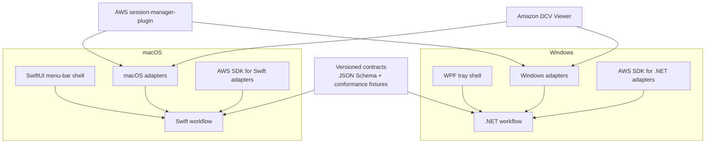

# SPECIFICATION: Cross-Platform SSM Connect Client

- **Status:** accepted — Phase 0 feasibility spikes in progress; implementation remains gated
- **Date:** 2026-08-17
- **Scope:** refactor the existing macOS implementation into explicit boundaries and add a Windows client
- **Related:** [`ssm-connect.spec.md`](./ssm-connect.spec.md), which remains the source of truth for current macOS behavior

## 1. Summary

SSM Connect currently ships as a working native macOS application. The repository has good
protocol seams and tests, but `SSMConnectKit` is one macOS-only Swift target containing domain
models, AWS implementations, connection orchestration, SwiftUI views, and operating-system
adapters. The connection state machine also directly owns macOS lifecycle concerns such as Darwin
signals, notifications, clipboard behavior, and application shutdown.

There is no supported tool that translates SwiftUI/AppKit into .NET or a Windows desktop UI.
Swift can compile for Windows, but that does not make Apple frameworks available there. The current
`aws-sdk-swift` integration and all platform integrations would still require separate validation
or replacement.

This specification chooses an incremental **native shells plus shared behavioral contracts**
architecture:

- Keep the existing native SwiftUI macOS application.
- Separate its domain, workflow, AWS, and macOS responsibilities into explicit Swift targets.
- Add a native Windows tray application in C# on .NET 10 LTS using WPF.
- Share versioned JSON schemas, state-transition fixtures, and acceptance behavior between clients.
- Do not attempt source-to-source translation or call Swift from .NET.

The two clients will share a product contract rather than a runtime binary. This avoids replacing a
working macOS app while still preventing the implementations from drifting.

## 2. Current-State Assessment

The code is modular at the file and protocol level; it is not one large file. Existing strengths
that MUST be preserved include:

- Provider protocols for authentication, EC2, SSM, Secrets Manager, tunnels, and DCV launching.
- An injected and heavily tested connection state machine.
- A thin `SSMConnectApp` executable target.
- A config-driven connection profile with no environment baked into the app.
- More than 100 tests around connection behavior and adapters.

The portability problem is target ownership:

| Concern | Current location | Portability issue |
|---------|------------------|-------------------|
| Models and profile validation | `SSMConnectKit` | Built in the same macOS-only target as SwiftUI/AppKit |
| Connection state machine | `SSMConnectKit` | Imports Observation and Darwin; owns app quit, clipboard, and notifications |
| AWS operations | `SSMConnectKit` | Coupled to Swift SDK error types in orchestration |
| Tunnel process | `SSMConnectKit` | Assumes a macOS app bundle, POSIX signals, and a macOS ARM plugin |
| DCV launch | `SSMConnectKit` | Assumes `/Applications`, AppKit, Unix mode `0600`, and macOS viewer settings |
| Persistence and login item | `SSMConnectKit` | Uses UserDefaults and `SMAppService` |
| UI | `SSMConnectKit` | SwiftUI, AppKit, SF Symbols, and Apple window APIs |

The first goal is therefore separation by responsibility, not a rewrite for its own sake.

## 3. Platform and Technology Decision

### 3.1 Chosen approach

| Platform | UI/runtime | AWS integration | Distribution |
|----------|------------|-----------------|--------------|
| macOS | Existing SwiftUI application | AWS SDK for Swift | Existing Homebrew cask and `.app` release |
| Windows | C#/.NET 10 LTS WPF tray application | AWS SDK for .NET | Signed installer published through WinGet |

WPF is selected for the first Windows client because it is stable, Windows-native, supports a
small background/tray application well, and has straightforward Win32 interoperability. WinUI 3
is not required to produce a modern-looking utility and adds packaging and tray integration risk.
The Windows UI MUST use current Fluent styling and MUST NOT imitate macOS controls.

Homebrew supports macOS, Linux, and Linux running under WSL; it does not install native Windows
desktop applications. WSL Homebrew is therefore not a distribution channel for this client.
**WinGet is the required Windows package-manager channel.** WinGet does not replace the installer:
it downloads and runs a publisher-hosted installer described by a versioned YAML manifest.

### 3.2 Rejected approaches

| Approach | Reason rejected |
|----------|-----------------|
| Transpile Swift/SwiftUI to C# | No production-grade transpiler exists; Apple UI and service frameworks have no Windows equivalent |
| Compile the current package with Swift for Windows | The package declares macOS 14 and directly imports AppKit, SwiftUI, ServiceManagement, UserNotifications, Observation, and Darwin |
| Rewrite both clients in Avalonia/Electron/Tauri now | Replaces a working native app and creates a large regression surface before Windows feasibility is proven |
| Share a Swift library through C ABI/FFI | Adds toolchain, ABI, packaging, debugging, and async interop complexity without removing the need for Windows AWS and OS adapters |
| Independently clone behavior with no contract | Fast initially, but profile formats, state transitions, retry behavior, and security rules would drift |

Avalonia MAY be reconsidered only if maintaining two native UIs becomes demonstrably more costly
than replacing the macOS UI. It is not part of this specification.

## 4. Goals and Non-Goals

### Goals

- Ship a Windows tray client with feature parity for single-user and multi-user connections.
- Preserve current macOS behavior throughout the refactor.
- Make workflow rules independent from UI and operating-system lifecycle APIs.
- Define one versioned, portable profile interchange format.
- Run the same behavioral conformance cases against Swift and .NET implementations.
- Keep credentials and DCV authentication material out of persistent storage.
- Produce independently releasable and testable macOS and Windows applications.
- Make the Windows client installable, upgradeable, and removable through WinGet.

### Non-Goals

- Linux desktop support in the first cross-platform release.
- Replacing Amazon DCV Viewer or `session-manager-plugin`.
- Sharing UI code between macOS and Windows.
- Loading Swift code into the Windows process.
- Changing workstation infrastructure or `dcv-session-agent` behavior.
- Redesigning the existing connection modes.
- Dropping or rewriting the current macOS application before Windows is proven.

## 5. Target Architecture



### 5.1 Repository layout

The final layout SHOULD be recognizable as follows. Names may change during planning, but the
boundaries MUST remain.

```text
contracts/
  connection-profile.schema.json
  state-machine.schema.json
  fixtures/
    profiles/
    workflows/
SSMConnectKit/
  Sources/
    SSMConnectDomain/       # values, states, validation; no UI or OS APIs
    SSMConnectWorkflow/     # orchestration against ports; no Apple frameworks
    SSMConnectAWS/          # aws-sdk-swift adapters and SDK error mapping
    SSMConnectMacOS/        # AppKit, notifications, clipboard, plugin, DCV
    SSMConnectUI/           # SwiftUI presentation
windows/
  SSMConnect.sln
  src/
    SSMConnect.Domain/
    SSMConnect.Workflow/
    SSMConnect.Aws/
    SSMConnect.Windows/
  tests/
    SSMConnect.Domain.Tests/
    SSMConnect.Workflow.Tests/
    SSMConnect.Windows.Tests/
```

### 5.2 Boundary rules

`SSMConnectDomain` and `SSMConnect.Domain` MUST contain only:

- Connection profile and app settings value types.
- Connection state and event value types.
- Validation rules and typed domain errors.
- Portable DCV connection-file rendering.
- No AWS SDK types, UI framework types, process APIs, persistence APIs, or global singletons.

`SSMConnectWorkflow` and `SSMConnect.Workflow` MUST:

- Implement the same ordered connection algorithm and state transitions.
- Depend only on domain types and injected ports.
- Receive timeout, clock, retry, lifecycle, and event-output dependencies.
- Not import AppKit, SwiftUI, ServiceManagement, UserNotifications, Darwin, WPF, Win32, or an AWS SDK.
- Not open browsers, update clipboards, post notifications, or send operating-system signals
  directly.

Platform and AWS projects MUST implement those ports. UI projects MUST observe workflow snapshots or
events and issue commands; they MUST NOT reproduce connection rules.

## 6. Portable Contracts

### 6.1 Connection profile

Create a JSON Schema with an explicit `schemaVersion`. Version 1 MUST cover:

- Stable profile ID and display name.
- SSO start URL, SSO region, account ID, role name, and resource region.
- Instance tag key and value.
- Connect mode: `singleUser` or `multiUser`.
- Local and remote DCV ports.
- Single-user secret ID.
- Multi-user agent remote port.
- Connect action and non-secret client preferences that are supported on both platforms.

The schema MUST NOT contain cached AWS credentials, access tokens, DCV passwords, presigned STS
URLs, tunnel session responses, or local temporary-file paths.

Each client MAY retain native storage internally. Both clients MUST support export and import of the
portable profile document. Unknown optional fields MUST be preserved where practical, and newer
unsupported required schema versions MUST fail with an actionable message.

### 6.2 Workflow conformance fixtures

Fixtures MUST describe inputs, provider outcomes, expected calls, emitted states, and terminal
results. At minimum, both implementations MUST run cases for:

- Reused SSO session and device login.
- Running, stopped, pending, stopping, and terminated instances.
- SSM readiness timeout and successful recovery.
- Tunnel startup, local-port collision, unexpected drop, and bounded reconnect.
- Single-user secret retrieval and DCV launch.
- Multi-user identity resolution, agent provisioning, token refresh, and DCV launch.
- Expired credentials during each AWS stage.
- Disconnect and stop-workstation cancellation.
- Application shutdown while a tunnel is active.
- Workstation instance replacement.

Fixtures MUST contain synthetic identifiers and credentials only.

## 7. Required Workflow Ports

Both workflow implementations MUST expose equivalent behavior through these conceptual ports:

| Port | Responsibility |
|------|----------------|
| `AuthProvider` | Reuse, refresh, or obtain AWS IAM Identity Center credentials |
| `EC2Provider` | Resolve, start, stop, and poll an instance |
| `SSMProvider` | Poll managed-instance readiness, start, and terminate an SSM session |
| `SecretsProvider` | Retrieve the single-user DCV password |
| `IdentityProvider` | Resolve caller identity and create fresh presigned identity tokens |
| `AgentClient` | Call the multi-user workstation agent through its transient tunnel |
| `TunnelProvider` | Validate plugin availability and manage a port-forward child process |
| `ReadinessProbe` | Test the forwarded DCV endpoint and classify failures |
| `DCVLauncher` | Materialize, launch, and clean a secure DCV connection file |
| `InstanceIdStore` | Remember the non-secret last instance ID for replacement detection |
| `Clock` / `Delay` | Supply deterministic timeouts, polling, and retry backoff |
| `EventSink` | Publish state snapshots, logs, warnings, and notification-worthy events |

Clipboard, desktop notifications, login-at-startup registration, browser opening, sleep/wake
handling, and application shutdown are shell services. They MUST be invoked by platform policy in
response to workflow events rather than embedded in the portable workflow.

## 8. Windows Functional Requirements

| ID | Priority | Requirement |
|----|----------|-------------|
| XP-01 | P0 | Run as a Windows notification-area application without requiring a console window. |
| XP-02 | P0 | Import AWS IAM Identity Center profiles from the standard user AWS config directory. |
| XP-03 | P0 | Implement existing SSO cache reuse, refresh, and interactive device authorization behavior with the AWS SDK for .NET. |
| XP-04 | P0 | Resolve, start, stop, and monitor the configured EC2 workstation with behavior matching macOS. |
| XP-05 | P0 | Start and supervise the official Windows `session-manager-plugin` using the same SSM port-forward document and session values. |
| XP-06 | P0 | Launch Amazon DCV Viewer for Windows from a generated connection file in both connection modes. |
| XP-07 | P0 | Support multi-user agent provisioning and presigned `sts:GetCallerIdentity` authentication. |
| XP-08 | P0 | Never persist AWS credentials, DCV passwords, or identity tokens. Restrict temporary connection files to the current user and remove them after launch. |
| XP-09 | P0 | Match the shared state-transition and error conformance suite. |
| XP-10 | P1 | Support connect, disconnect, reconnect, stop workstation, profile CRUD, and auto-connect. |
| XP-11 | P1 | Register startup behavior through a supported per-user Windows mechanism and expose a user-controlled toggle. |
| XP-12 | P1 | Post native Windows notifications for the same lifecycle events as macOS. |
| XP-13 | P1 | Recover or clean up a tunnel after process exit, app crash, suspend/resume, and user logoff. |
| XP-14 | P0 | Produce a signed, versioned x64 installer with silent install, upgrade, and uninstall support. The app itself MUST install per-user without elevation unless a validated dependency makes that impossible. |
| XP-15 | P1 | Provide accessible keyboard navigation, screen-reader labels, and high-DPI behavior. |
| XP-16 | P0 | Publish each stable Windows release through the WinGet community repository under a stable package identifier, proposed as `VHCo.SSMConnect`. |

## 9. Platform Adapter Requirements

### 9.1 Session Manager plugin

Before implementation, a Windows spike MUST verify the official plugin's five-argument invocation,
stdout/stderr behavior, exit codes, shutdown behavior, and x64 availability. AWS documents the
plugin for PowerShell and Command Prompt and warns that third-party command-line tools may be
incompatible, so the spike MUST launch it directly through `.NET Process` without relying on an
interactive shell. The product MUST either:

1. Bundle a pinned, checksum-verified official Windows binary and its license, matching the macOS
   supply-chain policy; or
2. Reliably discover and validate an official user installation.

Bundling is preferred for a one-click experience, subject to the spike confirming package layout
and redistribution terms. Process containment SHOULD use a Windows Job Object so the plugin is
terminated if the app exits unexpectedly.

### 9.2 Amazon DCV Viewer

The Windows adapter MUST discover the installed viewer using documented installation information or
file association, not one hardcoded path. A spike MUST prove:

- The Windows viewer accepts the generated `.dcv` format for both auth modes.
- Shell launch passes the file to the intended viewer.
- The viewer has consumed the file before deletion.
- Orphan cleanup is safe after crashes.

The temporary directory and file ACL MUST grant access only to the current user. Startup MUST sweep
only files created by SSM Connect, using an application-specific name and bounded age.

### 9.3 Windows lifecycle

The Windows shell MUST handle session ending, system suspend/resume, and process exit. Workflow
cancellation MUST run first; the Job Object provides best-effort cleanup if graceful shutdown does
not finish. Resume MUST run the same health check used by macOS wake handling before reporting the
tunnel as connected.

### 9.4 Installer and WinGet

Each stable Windows release MUST attach an immutable installer to the matching GitHub Release. The
installer URL MUST be direct HTTPS, version-specific, and owned by the publisher. The installer
MUST support unattended install and uninstall, register accurate Publisher and PackageName values
in Windows Installed Apps, and return reliable exit codes.

Release automation MUST generate the WinGet installer SHA-256 and a multi-file manifest containing
version, installer, and default-locale metadata. CI MUST validate the manifest. Before submission,
the release MUST be exercised in Windows Sandbox or a clean Windows VM for install, launch,
upgrade, uninstall, and residue checks. The release process then submits a version-specific pull
request to `microsoft/winget-pkgs` and records its status.

WinGet supports MSI, WiX, MSIX, EXE, and other installer formats. The Phase 0 packaging spike MUST
choose the underlying format based on tray startup, child-process launch, per-user installation,
code signing, clean upgrades, and clean uninstall. WinGet compatibility alone does not decide
between MSIX and WiX/MSI.

## 10. macOS Refactor Requirements

| ID | Priority | Requirement |
|----|----------|-------------|
| MR-01 | P0 | Preserve all current macOS behavior and public installation instructions. |
| MR-02 | P0 | Split domain/workflow code from Apple UI and lifecycle APIs before changing behavior. |
| MR-03 | P0 | Move concrete default dependency construction out of the workflow and into the macOS composition root. |
| MR-04 | P0 | Move Darwin signal handling and `AppQuitHandler` ownership into the macOS plugin/lifecycle adapter. |
| MR-05 | P0 | Move Observation annotations into an observable presenter or snapshot store; workflow rules MUST not require Observation. |
| MR-06 | P0 | Move AWS SDK error inspection into AWS adapters and expose typed portable failures to the workflow. |
| MR-07 | P1 | Compile and test the Swift domain/workflow targets without importing Apple-only frameworks. |
| MR-08 | P1 | Convert existing state-machine tests into shared fixture-backed tests where possible. |

The refactor MUST proceed in small behavior-preserving steps. It MUST NOT combine target extraction
with retry, authentication, profile, or UI redesign.

## 11. macOS Deployment Target

The existing minimum of **macOS 14 Sonoma** is intentional and uses modern APIs:

- Swift Observation (`@Observable` and `@Bindable`) is available from macOS 14.
- `MenuBarExtra` and `SMAppService` are modern APIs available from macOS 13.
- The SwiftUI app lifecycle is current and appropriate for this application.

This is not an old application model. The main executable uses SwiftUI and delegates only the
lifecycle behavior that still belongs in AppKit.

The author currently uses macOS 15 Sequoia and newer. The deployment target MAY be raised to macOS
15, but doing so provides no architectural benefit and would only exclude Sonoma users. Keep
macOS 14 unless a required API or dependency needs 15. The more significant current restriction is
**Apple Silicon only**, caused by fetching and packaging only the `mac_arm64`
`session-manager-plugin`. Intel support is outside this specification.

After MR-05, the pure workflow target will no longer require macOS 14 merely because of
Observation. The shipping app may still retain macOS 14 as its supported baseline.

## 12. Security Requirements

- Continue the current no-inbound-rules architecture; all workstation traffic uses SSM tunnels.
- Never log credentials, SSO tokens, secret values, presigned URLs, or DCV auth tokens.
- Keep DCV passwords and tokens in memory only for the shortest practical duration.
- Restrict temporary DCV files to the current OS user and remove them after viewer consumption.
- Verify downloaded plugin and packaging artifacts with pinned cryptographic checksums.
- Include third-party licenses in each platform package.
- Sign Windows release artifacts before general release.
- Run CodeQL for C# and GitHub Actions plus dependency and secret scanning.
- Threat-model profile import, process arguments, temporary files, URI/browser launch, and plugin
  replacement before release.

## 13. Delivery Phases

### Phase 0: Windows feasibility spikes

Build disposable command-line spikes for AWS SSO, SSM plugin invocation, and DCV launch. No UI and
no production abstractions. Record exact supported SDK/package versions and results in a plan.
Failure of a spike MUST change this specification before broad refactoring begins.

The spikes MUST run on actual Windows 11 x64, either physical or virtual. Linux inspection of a
Windows artifact can establish package contents and architecture, but it cannot validate process,
registry, file-association, ACL, browser, suspend/resume, or installer behavior.

#### Phase 0 status (2026-08-17)

| Spike | Status | Evidence / remaining work |
|-------|--------|---------------------------|
| Host readiness | Partial | Fedora host has KVM/QEMU, 20 GiB available RAM, and enough CPU support. No Windows image is present; only about 37 GiB disk is free. |
| AWS SDK for .NET SSO capability | Documented | AWS SDK for .NET v4 supports shared IAM Identity Center profiles, cached sessions, and programmatic browser login through `SSOAWSCredentials`; `AWSSDK.SSO` and `AWSSDK.SSOOIDC` are mandatory. Runtime login, refresh, and service calls remain untested. |
| Windows Session Manager plugin artifact | Inspected | Official current ZIP contains an x86-64 PE `session-manager-plugin.exe`, license, notice, third-party notices, and release notes. Direct `.NET Process` five-argument invocation, output draining, termination, and Job Object behavior remain untested on Windows. |
| Amazon DCV Windows artifact | Inspected | Amazon publishes signed x64 MSI and portable clients; the portable package contains `dcvviewer.exe`. `.dcv` consumption, both auth modes, process launch, and safe deletion remain untested on Windows. |
| Installer and WinGet | Documented | WinGet accepts MSI/WiX/MSIX/EXE and requires manifest validation, hashes, silent operation, clean install/uninstall, and publisher-hosted direct URLs. Installer format and clean-VM behavior remain untested. |

Phase 0 is complete only when all runtime rows pass on Windows, both connection modes reach DCV,
and the installer passes a clean install/upgrade/uninstall cycle. Artifact inspection alone is not
an implementation go-ahead.

### Phase 1: Contracts and golden fixtures

Create the versioned profile schema and extract representative conformance fixtures from current
Swift tests. Add schema validation and fixture checks to CI.

### Phase 2: Behavior-preserving Swift separation

Create the Swift domain, workflow, AWS, and macOS targets. Move one dependency boundary at a time,
running the existing focused tests after every move. Keep the released app behavior unchanged.

### Phase 3: Windows domain and workflow

Implement .NET domain types and workflow ports. Pass schema and mocked conformance tests before
writing the tray UI.

### Phase 4: Windows adapters and tray shell

Implement AWS, plugin, DCV, persistence, notification, startup, and lifecycle adapters. Add the WPF
tray and settings UI after one end-to-end connection succeeds from a development harness.

### Phase 5: Packaging and release hardening

Add installer creation, signing, checksums, CodeQL, release assets, WinGet manifest generation and
submission, upgrade/uninstall tests, and end-to-end tests on supported Windows versions.

## 14. Acceptance Criteria

- **AC-01:** Existing macOS tests pass before and after target separation with no user-visible
  regression in connect, reconnect, stop, wake, login item, settings, or DCV launch behavior.
- **AC-02:** Swift workflow/domain targets contain no imports of AppKit, SwiftUI,
  ServiceManagement, UserNotifications, or Darwin.
- **AC-03:** A versioned profile exported on macOS imports on Windows and produces equivalent
  validated values; the reverse direction also passes.
- **AC-04:** Swift and .NET pass the same required conformance fixtures and emit the same ordered
  states and terminal error categories.
- **AC-05:** Windows completes a single-user connection from SSO through DCV auto-login without a
  terminal command or inbound security-group rule.
- **AC-06:** Windows completes a multi-user connection with the resolved identity, agent-created
  session, and fresh identity token.
- **AC-07:** Disconnect, app exit, logoff, and crash do not leave a reusable orphan tunnel; startup
  safely handles any process or file residue.
- **AC-08:** Automated security tests find no persisted credential, DCV password, or presigned token
  in profile storage, logs, or ordinary temporary files.
- **AC-09:** Windows release CI builds, tests, scans, packages, and publishes a signed versioned
  artifact with checksums and licenses; the stable release is installable, upgradeable, and
  uninstallable through WinGet.
- **AC-10:** The current macOS release remains independently buildable and releasable throughout
  Windows development.

## 15. Initial Open Questions and Spike Decisions

These questions MUST be answered in Phase 0 rather than guessed during implementation:

1. Does AWS SDK for .NET v4 runtime behavior match the current app for IAM Identity Center cache,
  refresh, and device authorization when tested against a real SSO profile?
2. Does the official x64 Windows `session-manager-plugin` preserve the same five-argument contract,
  and may its ZIP payload be redistributed inside SSM Connect under the included terms?
3. Does Amazon DCV Viewer for Windows consume the current `.dcv` file fields identically in both
   modes, and what signal makes post-launch deletion safe?
4. Is MSIX compatible with plugin and DCV process launch plus per-user startup, or is a signed
   installer such as WiX the lower-risk packaging choice?
5. Which Windows 11 servicing baseline should be the minimum? Architecture is decided: x64 only for
  v1 because the official Session Manager plugin and DCV client artifacts inspected are x64.
6. Should profile export include app preferences, or only connection profiles? Proposed: profiles
   only in schema v1.

## 16. Planning Gate

The owner has accepted the native-shells direction. The implementation plan MUST begin with and
track Phase 0 spikes and MUST identify a rollback point after each Swift target extraction. No
Swift target refactor or production Windows UI work may begin until AWS SSO, the SSM plugin, DCV
launch in both auth modes, and installer lifecycle have succeeded on actual Windows 11 x64.