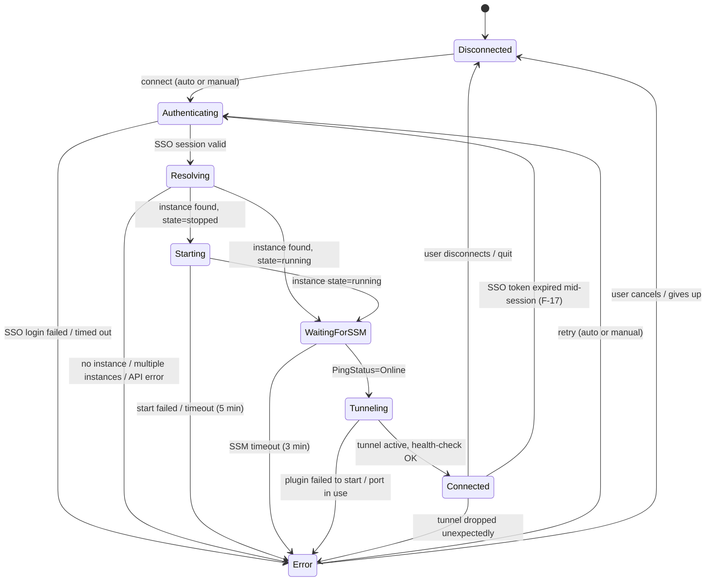
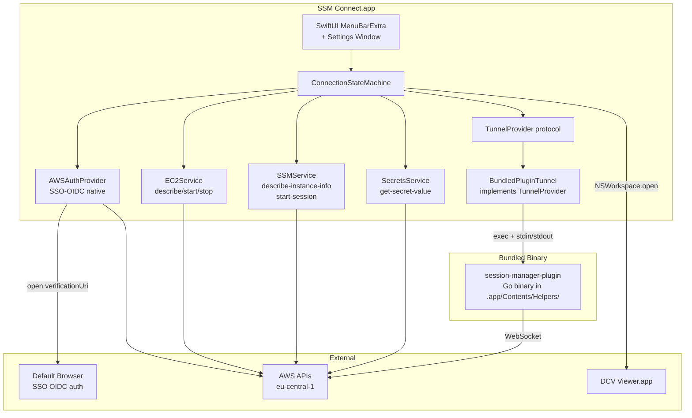

# SPECIFICATION: SSM Connect — macOS Menu-Bar App

| Field       | Value                                                      |
|-------------|------------------------------------------------------------|
| Version     | 1.3                                                        |
| Status      | Implemented & shipped — open-source, Homebrew cask (2026-06-06) |
| Repository  | [vhco-pro/ssm-connect](https://github.com/vhco-pro/ssm-connect) (private) |
| App identity | Name "SSM Connect"; bundle id `pro.vhco.ssm-connect`      |
| Platform    | macOS (native Swift / SwiftUI), min macOS 14 (Sonoma)      |
| Default profile | Account 111122223333 (factory-sts prod); resource region `eu-central-1`; SSO region `eu-west-1` |
| Design intent | General-purpose, config-driven SSM-tunnel connector — the factory workstation is just the default profile, nothing is hardcoded |
| Author      | michielvha                                                 |
| Date        | 2026-06-05                                                 |
| Companion   | `ec2-cloud-workstation-dcv.spec.md` (server-side spec, in the `one-b2c` workspace) |
| Runbook     | `workstation-client-setup.md` (manual flow being replaced, in the `one-b2c` workspace) |

---

## 1. Overview

**SSM Connect** is a native macOS menu-bar application that fully automates the manual `~/bin/workstation-connect` shell script and the step-by-step runbook for connecting to the EC2 + Amazon DCV cloud workstation. On launch (or at login) it transparently handles AWS SSO authentication, EC2 instance discovery by tag, instance start + SSM readiness wait, SSM port-forward tunnel establishment, DCV password retrieval from Secrets Manager, and DCV Viewer launch — with zero manual terminal commands. The user sees a single menu-bar icon reflecting connection state and can connect, disconnect, or check status from a dropdown menu.

**Design intent — a general-purpose tool, not a one-off.** Although the author's immediate need is a single factory-sts workstation, the app is designed as a **general, config-driven "get me into my cloud workstation" utility**: nothing about the connection (AWS account, SSO start URL, SSO region, resource region, instance tag, secret id, local/remote ports, and the viewer app to launch) is hardcoded. The factory workstation ships as the **default connection profile**, but the app supports **multiple named profiles** (§F-18) so it can drive any SSM-reachable EC2 workstation. First launch bootstraps the default profile from the user's `~/.aws/config`. This generality is a primary goal — the author is building it because no approachable "zero-config SSM workstation launcher" is known to exist.

The app does NOT replace the Amazon DCV Viewer itself — it orchestrates everything _before_ and _around_ the viewer. The post-tunnel "connect action" (launch DCV Viewer) is itself configurable so the same tunnel machinery can later drive RDP/VNC/SSH clients (§13, future).

> **Region note (from spike):** the SSO portal and the workstation live in **different regions** — SSO/OIDC + token cache are in `eu-west-1`, while EC2/SSM/Secrets Manager are in `eu-central-1`. The app MUST keep "SSO region" and "resource region" as separate config fields. Conflating them is a likely first-implementation bug.

## 2. Goals & Success Metrics

| Goal | Metric |
|------|--------|
| Zero-friction daily connect | User goes from "Mac just booted" to "DCV desktop visible" with ≤ 1 click (or zero clicks if auto-connect on login is enabled) |
| Eliminate CLI prerequisites | AWS CLI v2 and manual `aws sso login` / `aws ssm start-session` commands are no longer required on the user's Mac |
| Approachable for non-terminal users | A user unfamiliar with AWS CLI can connect by installing two apps (SSM Connect + DCV Viewer) and entering SSO credentials once in a browser |
| Reliable tunnel lifecycle | Tunnel auto-reconnects on transient failure; clean teardown on quit; no orphaned `session-manager-plugin` processes |
| Secure by default | No secrets persisted to disk; no inbound ports suggested; SSO tokens handled per AWS SDK conventions; hardened runtime + notarization |

## 3. Functional Requirements

| ID   | Priority | Requirement | Notes |
|------|----------|-------------|-------|
| F-01 | P0 | **Menu-bar presence.** App runs as a macOS menu-bar app (`MenuBarExtra` / `NSStatusItem`) with NO Dock icon. A single SF Symbol icon in the menu bar reflects the current connection state (see §5 state machine). Clicking it reveals a dropdown menu with status, actions, and settings access. | SwiftUI `MenuBarExtra` (macOS 13+) or fallback `NSStatusItem` for macOS 12 support |
| F-02 | P0 | **Launch at login.** App registers itself as a login item via `SMAppService.mainApp` (macOS 13+) so it starts automatically when the user logs in. This is user-toggleable from the Settings view and from System Settings → Login Items. | `SMAppService` is the Apple-blessed replacement for `SMLoginItemSetEnabled`. Requires the `com.apple.developer.login-item` entitlement only if using a helper-app pattern; `SMAppService.mainApp` does not |
| F-03 | P0 | **Auto-connect on launch.** When the app launches (including at login), it automatically begins the full connection flow (F-05 → F-12) unless the user has explicitly disabled auto-connect in Settings. A manual "Connect" button is always available in the menu. | Default: auto-connect enabled |
| F-04 | P0 | **AWS SSO authentication (native).** The app performs AWS SSO/OIDC login entirely in-process using `aws-sdk-swift`. Flow: `SSOOIDC.RegisterClient` → `SSOOIDC.StartDeviceAuthorization` → open the `verificationUriComplete` in the default browser → poll `SSOOIDC.CreateToken` (grant `urn:ietf:params:oauth:grant-type:device_code`) until the user completes browser auth → `SSO.GetRoleCredentials` to obtain temporary STS credentials. All SSO/OIDC calls use the profile's **SSO region** (e.g. `eu-west-1`), which is distinct from the **resource region** used for EC2/SSM/Secrets (e.g. `eu-central-1`). Credentials are held in memory for the session. | See ADR-1 for rationale. SSO region ≠ resource region (spike-confirmed) |
| F-05 | P0 | **SSO token cache reuse + silent refresh.** Before triggering a new browser login, the app checks `~/.aws/sso/cache/*.json` for an existing token whose `startUrl`/`region` match the active profile. (1) If the `accessToken` is non-expired, reuse it directly for `SSO.GetRoleCredentials`. (2) If expired but a `refreshToken` is present (the cache contains `clientId`, `clientSecret`, `refreshToken`, `registrationExpiresAt` — spike-confirmed), attempt a **silent refresh** via `SSOOIDC.CreateToken` with `grantType=refresh_token` before falling back to the browser flow (F-04). Only if both fail does the browser open. A silent refresh that the server **rejects** (e.g. `InvalidGrantException` / `ExpiredTokenException` from a stale or revoked refresh token) MUST NOT surface as a sign-in failure — it falls through transparently to the browser device-auth flow (F-04). | Cache format is identical to AWS CLI v2, so a recent `aws sso login` makes the app fully silent. Silent refresh avoids a browser round-trip for ~the SSO session lifetime. **After a browser device-auth login the app writes the new token back to `~/.aws/sso/cache` (CLI-compatible, `0600`)** so the *next* connect reuses/refreshes it instead of re-opening the browser (impl 2026-06-06) |
| F-06 | P0 | **Resolve instance by tag.** The app calls `EC2.DescribeInstances` with filters `tag:Name=<configured-tag>` and `instance-state-name=running,stopped` to resolve the workstation instance ID. The instance ID is NEVER hardcoded or persisted — it is resolved fresh on every connect attempt. | Default tag: `example-workstation`. Configurable in Settings (F-18). If zero or multiple instances match, surface an error (see Edge Cases §8) |
| F-07 | P0 | **Start instance if stopped.** If the resolved instance is in state `stopped`, the app calls `EC2.StartInstances` and then polls `EC2.DescribeInstances` until the state is `running`. The menu-bar shows the "Starting" state with a progress indicator. | Polling interval: 5 s. Timeout: 5 min (configurable). If still not running after timeout → error state |
| F-08 | P0 | **Wait for SSM registration.** After the instance reaches `running`, the app polls `SSM.DescribeInstanceInformation` (filter by instance ID) until `PingStatus == "Online"`. Only then does it proceed to tunnel setup. | Polling interval: 5 s. Timeout: 3 min. On first boot after a bootstrap change, SSM registration can take 60–90 s; on a warm start 15–30 s |
| F-09 | P0 | **SSM port-forward tunnel.** The app establishes an SSM port-forwarding session: `SSM.StartSession` with document `AWS-StartPortForwardingSession` and parameters `portNumber=["8443"]`, `localPortNumber=["<configured-local-port>"]`. It passes the `StartSession` response (stream URL + token + session ID) to the bundled `session-manager-plugin` binary, which handles the WebSocket data-channel protocol. The tunnel maps `localhost:<localPort>` → instance `:8443`. | See ADR-1 for the bundled-plugin decision. Default local port: 8443 (configurable via F-18). The tunnel process is a managed child process; see F-13 for lifecycle |
| F-10 | P0 | **Launch DCV Viewer with auto-login.** Once the tunnel is confirmed active (first successful health-check on `127.0.0.1:<localPort>`), the app writes a short-lived DCV **connection file** (`.dcv`, INI format — `[connect]` with `host=127.0.0.1`, `port=<localPort>`, `user=ec2-user`, `password=<fetched secret>`, `weburlpath=/`) to a `0600` temp file, launches Amazon DCV Viewer on it via `NSWorkspace.shared.open(_:configuration:)`, and **deletes the file after a short grace period** (so the viewer can read it first — see ADR-8 implementation note). Before launching the viewer the app **probes `127.0.0.1:<localPort>` (HTTPS, self-signed-cert-tolerant) until the in-VM DCV server answers** — `PingStatus=Online` (SSM agent) does not imply the DCV server is listening yet, and launching too early surfaced `cannot connect a new stream: endpoint is unreachable` (impl 2026-06-06). This logs the user straight into the DCV session with no manual entry. **Host MUST be the IPv4 loopback `127.0.0.1`, not `localhost`:** the SSM port-forward binds IPv4 only, but `localhost` resolves to IPv6 `::1` first on macOS, and the Viewer connects to `::1` without falling back → the same `endpoint is unreachable` error (root-caused 2026-06-29, see `docs/specs/bug-ipv6-localhost-endpoint-unreachable.spec.md`). | The `.dcv` route is the only DCV automation hook for credential injection (the running viewer has no API). The password-on-disk window is deliberate and bounded — see ADR-8 and F-11. If DCV Viewer is missing, see F-16. The post-tunnel "connect action" remains configurable (§13) |
| F-11 | P0 | **DCV password fetch, auto-login & copy.** The app calls `SecretsManager.GetSecretValue` for the profile's secret ID (default `ec2/workstation-dcv-password`) using the **resource region**, holds the plaintext in memory, and uses it two ways: (a) injected into the temp `.dcv` connection file for auto-login (F-10, ADR-8), and (b) **copied to the macOS clipboard** (`NSPasteboard`) on connect, because the user must re-enter it for the in-VM desktop/lock-screen login after the DCV session opens. It is also displayed (masked, reveal-on-click) in the menu with a "Copy Password" button. The password is NEVER persisted to UserDefaults or Keychain, and the only disk touch is the transient `0600` `.dcv` file deleted right after launch (ADR-8). | Clipboard auto-clear after 30 s (configurable, NF-03; 0 = disabled). Fetch happens once per connect; re-fetched on manual reconnect |
| F-12 | P0 | **Status display.** The menu dropdown shows: current state (with icon), instance ID (once resolved), instance state, tunnel status (PID, local port), elapsed connection time, last error (if any), and the masked DCV password with copy button. | Refreshes on state transitions and on a 30 s poll for tunnel health |
| F-13 | P0 | **Tunnel lifecycle management.** The `session-manager-plugin` child process is monitored. If it exits unexpectedly, the app transitions to `Error` state, surfaces the reason, and (if auto-reconnect is enabled) retries the tunnel after a 5 s backoff (up to 3 retries, then manual intervention required). On app quit (`applicationWillTerminate`), the app sends `SIGTERM` to the plugin process and waits up to 5 s for graceful exit, then `SIGKILL`. No orphaned plugin processes. | Also handles: plugin process crash, SIGPIPE, broken pipe on the WebSocket |
| F-14 | P1 | **Manual reconnect.** A "Reconnect" menu item tears down the existing tunnel (if any), re-resolves the instance (F-06), and re-runs the full connection flow. Useful after network changes, VPN reconnects, or if the instance was replaced (new instance ID). | |
| F-15 | P1 | **Manual stop instance.** A "Stop Workstation" menu item (with confirmation dialog) calls `EC2.StopInstances` on the current instance. It updates status to "Stopping…" and clears the tunnel. Useful to force an early stop without waiting for the 4-hour idle timer. | Confirmation dialog: "Stop the cloud workstation? It will shut down and can be restarted later." |
| F-16 | P1 | **DCV Viewer detection.** On launch and before attempting to open DCV Viewer (F-10), the app checks that `/Applications/DCV Viewer.app` exists (and optionally checks `LSApplicationQueriesSchemes` / `NSWorkspace.urlForApplication(withBundleIdentifier:)` for `com.amazon.dcv.viewer`). If missing, it shows an alert with install instructions: "Amazon DCV Viewer is required. Install it via: `brew install --cask dcv-viewer`" and a button linking to the DCV download page. The connection flow pauses at the "Connected (tunnel up)" state but does NOT fail — the tunnel remains available for manual DCV Viewer use. | |
| F-17 | P1 | **SSO session expiry handling.** If any AWS API call returns an `ExpiredTokenException` or `UnauthorizedAccessException` mid-session (e.g. SSO token expires after 8–12 h), the app transitions to the `Authenticating` state, triggers a new SSO login flow (F-04), and upon success resumes from the step that failed. The tunnel is NOT torn down preemptively — it remains up as long as the plugin process is alive (SSM sessions have their own credential scope). | |
| F-18 | P1 | **Connection profiles / configuration (multi-profile).** Configuration is modeled as a **list of named connection profiles**, with one marked active (default). Each profile holds: display name, AWS SSO start URL, **SSO region**, account ID, role name, **resource region** (separate from SSO region), EC2 instance tag key + value, Secrets Manager secret id (optional), local tunnel port, remote port (default 8443), and the **connect action** (default: launch `/Applications/DCV Viewer.app` at `https://localhost:<localPort>`; configurable command/URL template for future RDP/VNC/SSH). Global settings: auto-connect on launch, auto-reconnect on tunnel drop, clipboard auto-clear delay. Profiles + settings are stored in `UserDefaults` (no secrets). On first launch the app seeds a default profile from `~/.aws/config` (reads the `[profile workstation-prd]` / `[sso-session ...]` blocks for SSO start URL + regions) and from the fixed environment facts. | Single-workstation users simply use the one default profile and never see the multi-profile UI complexity; the list model just makes multi-instance/multi-account a config change, not a code change (see ADR-5) |
| F-19 | P2 | **Connection log.** The app maintains an in-memory ring buffer (last 200 log lines) of connection events (state transitions, API calls, errors, timestamps). Viewable from a "Show Log" menu item in a separate window. Not persisted to disk. Useful for troubleshooting. | |
| F-20 | P2 | **Notification support.** The app posts macOS `UNUserNotification` notifications for key events: "Connected to workstation", "Workstation stopped (idle timeout)", "Tunnel disconnected — reconnecting…", "SSO login required". Respects the user's macOS notification settings. | |

## 4. Non-Functional Requirements

| ID    | Category       | Requirement |
|-------|----------------|-------------|
| NF-01 | Security | **No secrets on disk.** DCV password (F-11) is held in memory only and never written to disk, UserDefaults, Keychain, or log files. SSO tokens are managed per the AWS SDK's standard cache (`~/.aws/sso/cache/`) which the SDK itself manages; the app does not write additional token files |
| NF-02 | Security | **No inbound exposure.** The app MUST NEVER suggest, create, or modify inbound security-group rules. All traffic to the workstation flows through the SSM tunnel (outbound HTTPS 443 from the client to the SSM regional endpoint). The spec, UI, and error messages must reinforce this |
| NF-03 | Security | **Clipboard hygiene.** After copying the DCV password, the app optionally clears the clipboard after a configurable delay (default: 30 s). When the password is cleared, a brief notification or menu status update confirms it. Setting the delay to 0 disables auto-clear |
| NF-04 | Security | **Hardened runtime (when notarizing).** For the personal v1 (ad-hoc signed, not notarized), Hardened Runtime is optional. When the app is later notarized for wider distribution (NF-06 upgrade path), enable Hardened Runtime with the minimum entitlements: `com.apple.security.network.client` (outbound), and only add `com.apple.security.cs.allow-unsigned-executable-memory` / `disable-library-validation` if the AWS SDK or plugin exec actually requires them — test without each first. The plugin is exec'd as a separate process, so library-validation entitlements should not be needed |
| NF-05 | Security | **Least-privilege IAM.** The app assumes the user's SSO role (currently `AdministratorAccess`). Document the minimum IAM permissions actually required by the app so a scoped role can be created later: `ec2:DescribeInstances`, `ec2:StartInstances`, `ec2:StopInstances`, `ssm:DescribeInstanceInformation`, `ssm:StartSession`, `ssm:TerminateSession`, `secretsmanager:GetSecretValue` (scoped to `ec2/workstation-dcv-password`). This is documentation-only for v1 — the app uses whatever role the SSO session provides |
| NF-06 | Security | **Signing & distribution (Homebrew-first).** v1 targets the author's own Mac, so a paid Apple Developer Program membership is **not required**: the app is signed locally (ad-hoc or free "personal team") and delivered via a personal **Homebrew tap cask**. Because such a build is not notarized, the cask documents the one-time Gatekeeper approval (`xattr -dr com.apple.quarantine` or right-click → Open). The bundled `session-manager-plugin` keeps its own signature and is exec'd as a child process (not loaded as a library), avoiding library-validation issues. **Upgrade path:** if the app is ever distributed to other users, enroll in the Apple Developer Program ($99/yr) to obtain a Developer ID certificate and notarize via `notarytool` for friction-free installs. See §6.3 and ADR-4 | 
| NF-07 | Performance | **Connect time (warm start).** From app launch to DCV Viewer opening: ≤ 15 s when the instance is already running and SSM-registered. This excludes SSO browser login time if a new login is required |
| NF-08 | Performance | **Connect time (cold start).** From app launch to DCV Viewer opening when the instance is stopped: ≤ 3 min (dominated by EC2 start + SSM registration, which take 60–90 s). The app must not add more than 5 s of overhead on top of AWS API latency |
| NF-09 | Performance | **Memory footprint.** Idle memory (tunnel active, no UI interaction): < 50 MB RSS. The `session-manager-plugin` child process is separate |
| NF-10 | Compatibility | **macOS version support.** Minimum deployment target: **macOS 14 (Sonoma)**. The author is on current hardware/OS (macOS 26, Xcode 26.5, Swift 6.3 — spike-confirmed) and explicitly does not need to support old hardware. Uses `MenuBarExtra` and `SMAppService` (both macOS 13+, comfortably satisfied). SwiftUI App lifecycle |
| NF-11 | Compatibility | **Apple Silicon (Intel optional).** v1 targets Apple Silicon (`arm64`) since that is the author's machine; the bundled `session-manager-plugin` must match (`arm64`). A universal binary (arm64 + x86_64) is only needed if Intel Macs must be supported — defer until required |
| NF-12 | Reliability | **Graceful degradation under corporate proxy.** The user's Mac may be behind a corporate proxy performing TLS interception (ENGIE/ISINFRA CA chain). The app uses the system trust store (`SecTrustEvaluate` / URLSession default behavior) which includes any corporate CA certificates the admin has installed. If AWS API calls fail due to TLS errors, the error message should suggest verifying corporate CA trust ("Check that your corporate proxy CA certificate is installed in the macOS System Keychain") |
| NF-13 | Maintainability | **Tunnel abstraction layer.** The SSM tunnel mechanism is abstracted behind a `TunnelProvider` protocol so the bundled-plugin implementation can be swapped for a native WebSocket implementation in the future without changing the rest of the app. See ADR-1 |
| NF-14 | Observability | **Structured logging.** The app uses `os.Logger` (Apple Unified Logging) with subsystem `pro.vhco.ssm-connect` (the distribution identity — no org-internal name shipped in the binary) and categories `auth`, `ec2`, `ssm`, `tunnel`, `ui`. Logs are viewable in Console.app. Sensitive values (passwords, tokens) are logged as `<private>` using `OSLogPrivacy` |

## 5. Connection Lifecycle — State Machine

The app's connection lifecycle is modeled as a finite state machine. The menu-bar icon reflects the current state.



### State → Menu-Bar Icon Mapping

| State | SF Symbol | Color | Tooltip |
|-------|-----------|-------|---------|
| Disconnected | `desktopcomputer` | Gray | "Workstation — Disconnected" |
| Authenticating | `person.badge.key` | Yellow (pulsing) | "Workstation — Signing in…" |
| Resolving | `magnifyingglass` | Yellow (pulsing) | "Workstation — Finding instance…" |
| Starting | `power` | Yellow (pulsing) | "Workstation — Starting instance…" |
| WaitingForSSM | `antenna.radiowaves.left.and.right` | Yellow (pulsing) | "Workstation — Waiting for SSM…" |
| Tunneling | `link` | Yellow (pulsing) | "Workstation — Opening tunnel…" |
| Connected | `desktopcomputer.and.arrow.down` | Green | "Workstation — Connected" |
| Error | `exclamationmark.triangle` | Red | "Workstation — Error: {message}" |

### Menu Dropdown Layout

The dropdown does **not** list all states at once. It surfaces only the *current* state plus a context-aware action, with the full state list available on demand:

1. **Header row** — the current state only: colored SF Symbol + label (e.g. "Workstation — Connected"). Non-interactive. The menu-bar icon mirrors this same state.
2. **Detail line** (when applicable) — a secondary, greyed, non-interactive line: session info such as `Signed in · expires 8:54 AM` when connected, or the last error message when in the `Error` state.
3. **Primary action button** — context-aware: `Connect` when disconnected, `Connecting…` (disabled) while transitioning, `Connected` (disabled) once connected, `Retry Connect` after an error. Later phases add `Disconnect` / `Reconnect` / `Stop Workstation` here per F-13/F-14/F-15.
4. **"All States" submenu** — an expandable legend listing all 8 states with their icons/colors (the §5 mapping above), for reference/troubleshooting. Collapsed by default.
5. **Quit** (⌘Q).

**Time formatting:** all wall-clock times shown to the user (e.g. session expiry) use a 12-hour clock with an explicit `AM`/`PM` suffix (`h:mm a`). Because SSO sessions last ~12 h, the expiry can fall on the same clock numerals as sign-in, so the AM/PM marker is required to disambiguate.

### State Transitions — Timing Budget

| Transition | Typical Duration | Timeout |
|------------|-----------------|---------|
| Authenticating → Resolving (cached token) | < 1 s | — |
| Authenticating → Resolving (browser login) | 10–30 s (user-dependent) | 5 min |
| Resolving → Starting/WaitingForSSM | < 2 s | 30 s |
| Starting → WaitingForSSM | 30–60 s | 5 min |
| WaitingForSSM → Tunneling | 15–60 s | 3 min |
| Tunneling → Connected | 2–5 s | 30 s |
| **Total (cold, with SSO cached)** | **~90–120 s** | **~12 min** |
| **Total (warm, SSO cached, instance running)** | **~5–10 s** | **~4 min** |

## 6. Architecture & Interface Contracts

### 6.1 High-Level Architecture



### 6.2 Key Protocols / Interfaces

**SSM service layer** (`SSMProviding`) — waits for the SSM agent then opens the port-forwarding session (Phase D):

```swift
protocol SSMProviding: Sendable {
    /// Poll DescribeInstanceInformation until PingStatus == .online (else throws notOnlineInTime).
    func waitForSSMOnline(instanceId: String, region: String, credentials: AWSCredentials,
                          timeout: Duration, interval: Duration) async throws
    /// Call StartSession with AWS-StartPortForwardingSession; returns sessionId/streamUrl/tokenValue.
    func startSession(instanceId: String, region: String, credentials: AWSCredentials,
                      localPort: Int, remotePort: Int) async throws -> SSMSessionResponse
}

enum SSMError: LocalizedError, Equatable {
    case notOnlineInTime(instanceId: String)
    case malformedSessionResponse   // StartSession returned without sessionId/streamUrl/tokenValue
}
```

**Tunnel abstraction** — `TunnelProvider` shells out to the bundled plugin in v1 (NF-13, ADR-1). The implemented signatures carry `region` + `instanceId` (needed to build the plugin's parameter JSON, §6.4) and use `Int` ports:

```swift
/// Abstracts the SSM port-forwarding tunnel mechanism.
/// v1: BundledPluginTunnel (shells out to session-manager-plugin)
/// Future: NativeWebSocketTunnel (reimplements SSM data-channel in Swift)
protocol TunnelProvider: Sendable {
    func startTunnel(session: SSMSessionResponse, region: String, instanceId: String,
                     localPort: Int, remotePort: Int) async throws -> TunnelHandle
    /// Check that the plugin binary exists and is executable.
    func checkAvailability() -> TunnelProviderStatus
}

protocol TunnelHandle: Sendable {
    var isActive: Bool { get }            // !finished && child process still running
    var processIdentifier: Int32? { get } // child PID, nil if not yet running
    func terminate() async                // SIGTERM → grace period → SIGKILL
    /// Emits exactly once when the tunnel drops, then finishes.
    var onDisconnect: AsyncStream<TunnelDropReason> { get }
}

enum TunnelProviderStatus: Equatable { case available, pluginMissing(path: String), pluginNotExecutable(path: String) }
enum TunnelDropReason: Equatable { case processExited(code: Int32, stderr: String), terminatedByUser }
enum TunnelError: LocalizedError, Equatable {
    case pluginMissing(path: String)               // D7 — binary absent
    case pluginNotExecutable(path: String)         // D7 — binary present but not +x
    case localPortInUse(port: Int, pid: Int32?, processName: String?)  // D6 — §8 port-in-use
    case launchFailed(reason: String)
}
```

**Process & port abstraction** — `BundledPluginTunnel` depends on `PluginSpawning` (spawns a
`SpawnedPluginProcess` wrapping `Foundation.Process`) and `PortProbing` (TCP-connect + `lsof`
occupant lookup), both injected so the tunnel's SIGTERM→SIGKILL lifecycle and port-in-use guard are
unit-testable without a real plugin binary (D8). The handle wires the process's `onExit` handler
**before** `start()` so no exit is missed.

### 6.3 Distribution & Signing

**v1 strategy (personal, Homebrew-first — no paid Apple account):**

| Aspect | Detail |
|--------|--------|
| **Bundle structure** | `SSM Connect.app/Contents/MacOS/SSM Connect` (main binary), `SSM Connect.app/Contents/Helpers/session-manager-plugin` (Go binary for macOS `arm64`) |
| **Code signing** | Ad-hoc (`codesign -s -`) or free "personal team" signing — sufficient to run on the author's own Mac. Sign the `session-manager-plugin` binary, then the outer app bundle |
| **Notarization** | **Not done in v1** (requires a paid Developer ID). Acceptable because the app runs only on the author's machine |
| **Delivery (v1)** | Personal **Homebrew tap cask** (`brew install --cask vhco-pro/tap/ssm-connect`). `brew upgrade` is the update mechanism (ADR-6). The cask README documents the one-time Gatekeeper approval for an un-notarized app: right-click → Open, or `xattr -dr com.apple.quarantine "/Applications/SSM Connect.app"` |
| **`session-manager-plugin` sourcing** | Download the **official AWS-signed** macOS plugin package at build time, verify its signature/checksum, then embed the extracted binary (ADR-7). Most-secure option per the author's preference — avoids trusting a locally-built or arbitrary binary |
| **`session-manager-plugin` licensing** | Apache 2.0 ([aws/session-manager-plugin](https://github.com/aws/session-manager-plugin)). Bundling is permitted. Include the LICENSE file in `Contents/Resources/` |

**Upgrade path (only if shared with other users):** enroll in the Apple Developer Program ($99/yr) → obtain a `Developer ID Application` certificate → sign app + plugin with `--options=runtime` (Hardened Runtime) → `xcrun notarytool submit … --wait` → `xcrun stapler staple`. This removes all Gatekeeper friction. No code changes required — only the signing/release pipeline changes. See ADR-4.

### 6.4 Bundled `session-manager-plugin` — Invocation Contract

The app calls `SSM.StartSession` via the SDK, which returns:

```json
{
  "SessionId": "workstation-prd-0abc1234def56789",
  "StreamUrl": "wss://ssmmessages.eu-central-1.amazonaws.com/v1/data-channel/workstation-prd-0abc1234def56789?role=publish_subscribe",
  "TokenValue": "AAEAAf..."
}
```

The app then execs the bundled plugin:

```bash
/path/to/SSM Connect.app/Contents/Helpers/session-manager-plugin \
  '{"SessionId":"...","StreamUrl":"wss://...","TokenValue":"AAE..."}' \
  "eu-central-1" \
  "StartSession" \
  "" \
  '{"Target":"i-xxx","DocumentName":"AWS-StartPortForwardingSession","Parameters":{"portNumber":["8443"],"localPortNumber":["8443"]}}'
```

The plugin opens a WebSocket to `StreamUrl`, performs the SSM data-channel handshake, and listens on `localhost:8443`. The app monitors the child process and reads its stdout/stderr for status and errors.

## 7. Acceptance Criteria

| Req  | Acceptance Criterion |
|------|----------------------|
| F-01 | **Given** the app is launched, **when** the user looks at the macOS menu bar, **then** a status icon is visible with no Dock icon. Clicking the icon reveals a dropdown with connection status and action buttons |
| F-02 | **Given** the user enables "Launch at Login" in Settings, **when** the user logs in to macOS, **then** the app starts automatically as a menu-bar app (visible in System Settings → Login Items) |
| F-03 | **Given** auto-connect is enabled and a valid SSO session exists, **when** the app launches at login, **then** the full connection flow completes without user interaction and DCV Viewer opens |
| F-04 | **Given** no valid SSO token exists, **when** the app begins the connection flow, **then** the default browser opens to the AWS SSO authorization page, the menu shows "Waiting for browser login…", and upon successful browser auth the app obtains STS credentials and proceeds |
| F-05 | **Given** the user recently ran `aws sso login --profile workstation-prd`, **when** the app checks `~/.aws/sso/cache/`, **then** it finds and reuses the valid token without opening the browser |
| F-05 | **Given** a cached token is expired and its `refreshToken` is rejected by `CreateToken` (`InvalidGrantException`), **when** the app signs in, **then** it silently falls back to the browser device-auth flow rather than reporting a sign-in error |
| F-06 | **Given** the EC2 instance has been replaced (new instance ID), **when** the app connects, **then** it resolves the current instance ID by the configured tag and connects successfully |
| F-07 | **Given** the instance is in state `stopped`, **when** the app connects, **then** it starts the instance, shows "Starting instance…" in the menu, and proceeds once `running` |
| F-08 | **Given** the instance is `running` but SSM agent is not yet registered, **when** the app polls SSM, **then** it waits (showing "Waiting for SSM…") until `PingStatus=Online` before opening the tunnel |
| F-09 | **Given** SSM reports `Online`, **when** the app starts the tunnel, **then** `localhost:8443` accepts TCP connections and forwards them to the instance's port 8443 via the SSM WebSocket channel |
| F-10 | **Given** the tunnel is active and DCV Viewer is installed, **when** the app reaches the Connected state, **then** it writes a `0600` temp `.dcv` connection file, launches DCV Viewer on it, deletes the file after a short grace period (so the viewer reads it first), and the viewer connects to `localhost:<localPort>` and logs in automatically without manual host/password entry |
| F-11 | **Given** the tunnel is active, **when** the app connects, **then** the DCV password is fetched from Secrets Manager, injected into the `.dcv` file for auto-login (F-10), and copied to the clipboard so the user can paste it for the in-VM desktop login. The password is never written to UserDefaults or Keychain, and the only disk artifact is the transient `.dcv` file deleted right after launch |
| F-12 | **Given** the app is connected, **when** the user opens the menu, **then** the current instance ID, connection duration, tunnel PID, and local port are displayed |
| F-13 | **Given** the tunnel process exits unexpectedly, **when** auto-reconnect is enabled, **then** the app retries the tunnel within 5 s (up to 3 attempts). On app quit, no `session-manager-plugin` processes remain |
| F-14 | **Given** a network change occurs, **when** the user clicks "Reconnect", **then** the existing tunnel is torn down, the instance is re-resolved by tag, and a new tunnel is established |
| F-15 | **Given** the user clicks "Stop Workstation" and confirms, **when** the API call succeeds, **then** the instance transitions to `stopping`/`stopped` and the menu reflects "Disconnected" |
| F-16 | **Given** DCV Viewer is not installed at `/Applications/DCV Viewer.app`, **when** the app reaches the Connected state, **then** it shows an alert with install instructions and keeps the tunnel running |
| F-17 | **Given** an SSO token expires during an active session, **when** an AWS API call fails with `ExpiredTokenException`, **then** the app re-triggers SSO login and resumes without tearing down the active tunnel |
| F-18 | **Given** the user has two connection profiles (e.g. `workstation-prd` and a second workstation) and switches the active profile, **when** the app reconnects, **then** it uses that profile's own SSO region, resource region, account/role, tag and ports — and changing a profile's resource region (e.g. to `us-east-1`) targets EC2/SSM/Secrets calls there while SSO auth still uses that profile's SSO region |
| F-19 | **Given** an error occurs during connection, **when** the user opens "Show Log", **then** timestamped log entries show the exact API call and error response |
| F-20 | **Given** the app connects successfully, **when** macOS notification permissions are granted, **then** a notification "Connected to workstation" is posted |

## 8. Edge Cases & Error Handling

| Scenario | Expected Behavior |
|----------|-------------------|
| **SSO login times out (user doesn't complete browser auth within 5 min)** | Transition to Error state: "SSO login timed out. Click Connect to retry." The OIDC device authorization has a server-side expiry (~5 min); the app respects it |
| **SSO token expires mid-session** | Intercept `ExpiredTokenException` on any AWS API call, transition to Authenticating, re-login, and resume. The SSM tunnel itself is NOT affected (it has its own credential scope from `StartSession`) |
| **Instance not found (zero tag matches)** | Error: "No workstation instance found with tag `Name=example-workstation`. Verify the tag in Settings or check the AWS Console." |
| **Multiple instances match tag** | Error: "Multiple instances match tag `Name=…`. Expected exactly one. Instance IDs: i-xxx, i-yyy." (This indicates a provisioning issue.) |
| **Instance stuck in `pending` state** | The app polls instance state. If `pending` for > 5 min, transition to Error: "Instance is stuck in `pending` state. Check the AWS Console." |
| **Instance in `terminated` or `shutting-down` state** | Error: "Workstation instance is terminated. It may need to be re-provisioned. Contact your platform team." |
| **SSM not Online after 3 min** | Error: "Instance is running but SSM agent has not registered. This may happen on first boot (cloud-init still running). Wait a few minutes and retry." |
| **Local port 8443 already in use** | Before starting the plugin, check if `localhost:8443` is bound (attempt a TCP connect). If in use: (a) check if it's an existing `session-manager-plugin` for the same session (reuse/kill); (b) if a different process, show error: "Port 8443 is in use by PID <pid> (<process name>). Free the port or change the local port in Settings." |
| **Tunnel drops (plugin exits with non-zero)** | If auto-reconnect enabled: retry up to 3 times with 5 s backoff. After 3 failures: Error state with the plugin's stderr. If auto-reconnect disabled: immediate Error state |
| **DCV Viewer not installed** | Alert: "Amazon DCV Viewer is required but not found at /Applications/DCV Viewer.app. Install via `brew install --cask dcv-viewer` or download from https://download.amazondcv.com." The tunnel remains active — the user can install DCV Viewer and manually connect. No `.dcv` file is written when the viewer is absent (nothing would consume it) |
| **DCV Viewer already running** | `NSWorkspace.open` with the `.dcv` file opens a new connection for that workstation; an existing session is unaffected. No special handling needed |
| **Temp `.dcv` write/cleanup** | The connection file is created with `0600` perms in the user's temp dir, opened, then deleted as soon as the viewer launch returns (and unconditionally on a `defer`/error path). If the app crashes between write and delete, a stale `.dcv` containing the password could remain — mitigated by a startup sweep that removes any leftover `ssm-connect-*.dcv` temp files. See ADR-8 |
| **AWS credentials lack required permissions** | Surface the exact AWS error (e.g. `AccessDeniedException` on `ssm:StartSession`) with guidance: "Your AWS role may lack the required permission: `ssm:StartSession`. Contact your AWS administrator." |
| **Network offline / DNS failure** | URLSession will throw `NSURLErrorNotConnectedToInternet` or `NSURLErrorCannotFindHost`. Error: "No network connection. Check your Wi-Fi or VPN and try again." |
| **Corporate proxy TLS interception** | If AWS API calls fail with certificate validation errors: "TLS certificate validation failed. If you're behind a corporate proxy, ensure the proxy CA certificate is trusted in the macOS System Keychain." The app uses the system trust store by default |
| **`session-manager-plugin` binary missing from bundle** | On launch, verify the binary exists at the expected path inside the bundle. If missing: fatal error — "The session-manager-plugin binary is missing from the app bundle. Reinstall SSM Connect." |
| **`session-manager-plugin` not executable / blocked by Gatekeeper** | If `exec` fails with EPERM: "The session-manager-plugin binary cannot be executed. It may need to be re-signed or approved in System Settings → Privacy & Security." |
| **Instance auto-stopped while user is in the menu** | The menu polls instance state every 30 s. If the instance transitions to `stopped` while Connected, the tunnel will drop → auto-reconnect will re-start the instance. UX copy: "Your workstation was auto-stopped after 4 hours of inactivity. Reconnecting…" |
| **App launched but user never set the DCV password secret** | `SecretsManager.GetSecretValue` returns `ResourceNotFoundException` or the value is empty. Show: "DCV password not set. Ask your administrator to set the secret `ec2/workstation-dcv-password` in AWS Secrets Manager." The tunnel still opens (DCV Viewer login will fail) |

## 9. Out of Scope

- **Server-side provisioning / Terraform** — this spec covers the macOS client only. The EC2 instance, IAM roles, security groups, and bootstrap are managed by the `ec2-cloud-workstation-dcv.spec.md` (in the `one-b2c` repo)
- **Replacing DCV Viewer** — the app orchestrates DCV Viewer; it does not implement a DCV client
- **Non-DCV connect targets (RDP / VNC / SSH)** — the connect action is configurable (F-18) and the architecture supports it, but v1 ships and tests only the DCV Viewer launch. Driving other clients is a future, config-only extension (§13)
- **Windows / Linux client** — v1 is macOS-only. A cross-platform path (Tauri, Electron) is documented as a future alternative (see ADR-2)
- **Idle auto-stop management** — the 4-hour idle timer runs server-side (systemd timer on the instance). The app does not manage or configure it
- **AWS CLI installation** — the app removes the dependency on AWS CLI. DCV Viewer is still required
- **VPN management** — the app assumes network connectivity to AWS endpoints is available (directly or via VPN). It does not manage VPN connections
- **Password rotation or generation** — the DCV password is managed out-of-band in Secrets Manager
- **iOS / iPadOS companion app** — not in scope

> **Now in scope (was previously out):** **multi-profile / multi-instance / multi-account** support via the connection-profiles model (F-18, ADR-5). A single-workstation user just uses the one default profile.

## 10. Architecture Decision Records

### ADR-1: Native SDK Auth + Bundled `session-manager-plugin` for Tunnel

**Status:** Accepted

**Context:** The app needs to (a) authenticate to AWS via SSO, (b) interact with EC2/SSM/SecretsManager APIs, and (c) establish an SSM port-forwarding tunnel. The AWS SDK for Swift (`aws-sdk-swift`) supports (a) and (b) natively. For (c), the SDK exposes `SSM.StartSession` which returns a WebSocket stream URL + token, but the actual port-forwarding data-channel protocol (message framing, acknowledgements, port-forwarding payload multiplexing) is implemented only in the open-source `session-manager-plugin` Go binary.

**Decision:** Use `aws-sdk-swift` for all AWS API interactions (SSO-OIDC, SSO, EC2, SSM, SecretsManager) natively. For the SSM port-forwarding tunnel, bundle the `session-manager-plugin` binary inside the `.app` bundle (`Contents/Helpers/`) and shell out to it, passing the `StartSession` response. Abstract the tunnel behind a `TunnelProvider` protocol (NF-13) so it can be swapped later.

**Alternatives considered:**

| Alternative | Pros | Cons |
|------------|------|------|
| **Full-native Swift WebSocket tunnel** | No external binary; smaller bundle; no signing complications | Must reimplement the entire SSM data-channel protocol (message types, acknowledgements, handshake, port-forwarding mux). Undocumented beyond the Go source. High effort (weeks), high risk of subtle incompatibilities. |
| **Shell out to `aws` CLI for everything** | Simple; user already has it | Defeats the purpose (removing CLI dependency). Parsing CLI output is fragile. No native SSO token management. |
| **Embed a Go library via CGo** | Native-ish; reuse plugin code directly | CGo + Swift interop is complex. Cross-compilation (arm64/x86_64) adds build complexity. Licensing fine (Apache 2.0) but build toolchain burden is high. |

**Consequences:**
- The app bundle is ~15 MB larger (plugin binary).
- The plugin binary must be code-signed and included in notarization.
- `Process`/`posix_spawn` is used to manage the plugin lifecycle; the app must handle child-process monitoring, signal forwarding, and cleanup.
- Future migration to a native tunnel is possible by implementing `TunnelProvider` with a Swift WebSocket client — no other code changes needed.

---

### ADR-2: Swift / SwiftUI Menu-Bar App over Electron / Tauri

**Status:** Accepted

**Context:** The app should feel like a polished native macOS utility. Electron and Tauri are cross-platform alternatives.

**Decision:** Build as a native Swift / SwiftUI app targeting macOS 14+.

**Rationale:**

| Factor | Native Swift/SwiftUI | Electron | Tauri |
|--------|---------------------|----------|-------|
| Menu-bar integration | First-class (`MenuBarExtra`) | Requires `Tray` API; less native feel | Possible via `system-tray`; less polished |
| Binary size | ~5 MB (+ plugin) | ~150 MB | ~10 MB |
| Memory idle | ~20 MB | ~80–150 MB | ~30 MB |
| macOS API access | Full (Keychain, Notifications, NSWorkspace, SMAppService) | Via native modules (complex) | Via Tauri plugins or raw FFI |
| Login item | `SMAppService` — one line | Hack: `app.setLoginItemSettings` (Electron's API) | Custom |
| Notarization | Standard Xcode workflow | Works but complex | Works |
| Cross-platform | No | Yes (Windows, Linux) | Yes (Windows, Linux) |

**Consequences:**
- macOS-only for v1. If cross-platform becomes required, Tauri is the recommended migration path (Rust backend + WebView frontend, small binary, good native API access). The AWS SDK for Rust (`aws-sdk-rust`) is mature.
- Requires Xcode for building; signing is local/ad-hoc for v1 (no paid Apple Developer account — see ADR-4).

---

### ADR-3: Login Item via `SMAppService.mainApp`

**Status:** Accepted

**Context:** The app should optionally launch at macOS login. Apple provides several mechanisms: `SMAppService` (macOS 13+), deprecated `SMLoginItemSetEnabled`, `LSSharedFileList` (private API), or a LaunchAgent plist.

**Decision:** Use `SMAppService.mainApp.register()` / `.unregister()` for login-item registration.

**Rationale:**
- `SMAppService` is Apple's current recommended API (introduced macOS 13, comfortably below our macOS 14 minimum target).
- It appears in System Settings → General → Login Items, giving the user full control.
- No helper bundle or LaunchAgent plist needed.
- It works correctly with sandboxed and non-sandboxed apps.
- The deprecated alternatives (`SMLoginItemSetEnabled`) still work but are likely to be removed in a future macOS release.

**Consequences:**
- macOS 12 and earlier are not supported (acceptable per NF-10).
- If the user removes the login item from System Settings, the app's Settings toggle must reflect that (query `SMAppService.mainApp.status`).

### ADR-4: Homebrew-First Distribution Without a Paid Apple Developer Account

**Status:** Accepted

**Context:** The author has no Apple Developer Program membership (only a free personal Apple ID), does not intend to use the App Store, and the app is initially for personal use on the author's own Mac. Notarization — the thing that lets an app run on *other* Macs without Gatekeeper friction — requires a paid ($99/yr) Developer ID certificate.

**Decision:** For v1, sign locally (ad-hoc or free personal team) and distribute through a personal **Homebrew tap cask**; do **not** notarize. Document the one-time Gatekeeper approval in the cask. Keep the codebase notarization-ready so the only change needed for wider distribution is the signing/release pipeline.

**Rationale:** A paid account is unnecessary to run a self-built app on your own machine. Homebrew is the author's preferred install/update channel (ADR-6). Deferring the $99 cost until there is an actual multi-user need is the pragmatic choice.

**Consequences:** Other users installing the un-notarized build must run `xattr -dr com.apple.quarantine` or right-click → Open once. Hardened Runtime/entitlement tuning (NF-04) is deferred until notarization is actually pursued.

---

### ADR-5: Config-Driven Multi-Profile Model (Single Instance as Default)

**Status:** Accepted

**Context:** The immediate need is one factory-sts workstation, but the author wants a *general* tool with nothing hardcoded, that could connect to any SSM-reachable EC2 workstation.

**Decision:** Model configuration as a list of named **connection profiles** (F-18), each fully describing a connection (SSO + resource regions, account, role, tag, secret, ports, connect action). Ship one default profile seeded from `~/.aws/config`. The single-workstation experience is just "one profile"; multi-account/multi-instance is the same model with more entries.

**Rationale:** Making the connection data a config object (not constants) costs almost nothing now and avoids a rewrite if the workstation fleet grows or the tool is reused for other environments. Directly serves the "general tool" intent.

**Consequences:** Settings UI must handle a list (add/edit/duplicate/delete/select-active), though it can collapse to a simple single-profile view when only one exists. The state machine operates on "the active profile."

---

### ADR-6: Updates via Homebrew (No In-App Updater for v1)

**Status:** Accepted

**Context:** macOS apps often self-update via Sparkle. The author prefers Homebrew.

**Decision:** Ship updates through the Homebrew tap cask; `brew upgrade` is the update path. No Sparkle/in-app updater in v1.

**Consequences:** Updating requires `brew upgrade`. Sparkle can be added later if non-Homebrew users appear. Cask versioning + checksum must be maintained per release.

---

### ADR-7: Bundle the Official AWS-Signed `session-manager-plugin`

**Status:** Accepted

**Context:** The plugin binary (ADR-1) can be sourced from the user's Homebrew install, built from source, or downloaded from AWS. The author asked for the most secure option.

**Decision:** At build time, download the **official AWS-published** macOS `session-manager-plugin` package, **verify its signature/checksum**, extract the binary, and embed it in the app bundle. Pin the version and record the checksum in the build script.

**Rationale:** Using AWS's signed artifact (rather than an arbitrary local copy or a self-built binary) gives the strongest provenance guarantee with the least toolchain burden (no Go compiler needed). Pinning + checksum makes the supply chain reproducible.

**Consequences:** The build needs network access to AWS's distribution endpoint and a checksum-verification step. Plugin updates are a deliberate, version-bumped action.

### ADR-8: DCV Auto-Login via a Transient `.dcv` Connection File

**Status:** Accepted (supersedes the original F-10 "no auto-fill / manual copy only" stance)

**Context:** The running DCV Viewer exposes no API for credential injection, so the original spec settled for launching the viewer and copying the password to the clipboard for a manual paste. However, Amazon DCV Viewer supports **connection files** (`.dcv`, INI format): opening one with a populated `[connect]` section (including `password=`) makes the viewer connect and log in automatically. The author wants true one-click login. This collides with the original F-11 guarantee that the password is *never* written to disk.

**Decision:** On connect, write the password into a short-lived `.dcv` connection file (`host=localhost`, `port=<localPort>`, `user=ec2-user`, `password=<secret>`, `weburlpath=/`), create it with `0600` permissions in the per-user temp directory, `open` it with DCV Viewer, then **delete it after a short grace period** (~5 s) so the viewer has read it. On a launch failure the file is deleted immediately. A startup sweep removes any stale `ssm-connect-*.dcv` files left by a crash. The same fetched password is **also** copied to the clipboard (F-11) because the user must re-authenticate to the in-VM desktop after the DCV session opens. The password is still never written to UserDefaults or Keychain.

> **Implementation note (confirmed 2026-06-06):** `NSWorkspace.open`/`open` returns when DCV Viewer is *launched*, not after it *reads* the file. DCV reads the connection file asynchronously, so deleting it "immediately" races that read — the viewer then fails with a misleading `error on dns resolution (domain: 'file')`. Verified by reproduction: a persistent `.dcv` makes DCV Viewer connect to `localhost:<port>` and reach its login screen (TCP `localhost:62047→8443` ESTABLISHED via the tunnel), while immediate deletion fails. The grace-period delete fixes auto-login while keeping the on-disk exposure bounded (a `0600` temp file for a few seconds, then removed; sweep covers a crash within the window).

**Rationale:** The `.dcv` file is the only supported automation hook for DCV credential injection. A `0600` temp file deleted a few seconds after launch is a small, bounded exposure that buys genuine one-click UX. Keeping the clipboard copy preserves the in-VM re-login workflow.

**Consequences:** The strict "password never touches disk" invariant is relaxed to "password only touches disk in a transient `0600` temp file, deleted right after viewer launch." Mitigations: minimal lifetime, restrictive perms, per-user temp dir, and a startup sweep for orphaned files. If a future DCV Viewer offers a stdin/keychain credential path, prefer it and drop the disk write.

### ADR-9: Automated Versioning & Release via GitVersion + Homebrew Cask Bump

**Status:** Accepted (2026-06-06)

**Context:** v1 shipped its first artifact by hand (build → zip → GitHub release → cask edit). That is error-prone and doesn't scale to repeated releases. The author already runs a standard release pipeline across the `stackweaver` repos (GitVersion + a release bot).

**Decision:** Adopt GitVersion as a **single-job workflow that needs no GitHub App / bot** — just the repo's built-in `GITHUB_TOKEN`. (GitVersion / the reusable `michielvha/gitversion-tag-action` only need a token with `contents: write` to push the tag; the stackweaver repos use a release-bot App **only** because a tag pushed by `GITHUB_TOKEN` can't *trigger a second workflow* — and the chained `tag.yml → release.yml` pattern relies on that trigger. Here tag + build happen in one job, so no second-workflow trigger is needed and `GITHUB_TOKEN` suffices.)
- `gitversion.yml` (GitHubFlow, **`v` tag prefix**, `increment: None` + ContinuousDeployment) derives the next semantic version from conventional-commit messages (`feat:` → minor, `fix:`/`perf:`/`refactor:` → patch, `BREAKING CHANGE`/`!:` → major, `chore`/`docs`/`ci`/etc → **no bump → same version → no release**).
- `.github/workflows/release.yml` — on every push to `main`, a `macos-14` runner computes the version with GitVersion and gates on whether `vX.Y.Z` is already tagged. Only on a **new** version does it tag with the reusable `michielvha/gitversion-tag-action` (`prefix: v`, pushing with `GITHUB_TOKEN`), stamp `Info.plist`, build the ad-hoc-signed `.app` via `scripts/release.sh`, and `gh release create` the Release with the zip asset. A no-bump push resolves to the existing version → the whole build/release is skipped.
- The Homebrew cask (`version` + `sha256`) is bumped automatically by a **`sync-cask` workflow inside `vhco-pro/homebrew-tap`** that watches this repo's releases (schedule + `workflow_dispatch`) and rewrites its own cask with **its own `GITHUB_TOKEN`** — so no cross-repo App, PAT, or deploy-key is needed anywhere.

**Consequences:** Releases are cut by merging conventional commits to `main` — no manual version picking, tagging, or artifact upload, and **no GitHub App / cross-repo secret anywhere** (release uses the repo's own `GITHUB_TOKEN`; the cask bump uses the tap's own `GITHUB_TOKEN`). The cask trails a release by at most the tap's poll interval (~30 min) unless its `sync-cask` workflow is dispatched manually. The macOS artifact is ad-hoc signed; the notarization upgrade path (ADR-4) plugs into the same `release.yml` when pursued.

## 11. Resolved Decisions & Remaining Open Questions

### 11.1 Resolved (this iteration)

| # | Question | Decision |
|---|----------|----------|
| 1 | Apple Developer account for signing/notarization | **Not required for v1.** App is for the author's own Mac → ad-hoc/personal-team signing + Homebrew tap, no notarization. Paid Developer ID is a documented upgrade path only if shared with other users (ADR-4, NF-06) |
| 2 | DMG vs Homebrew for delivery | **Homebrew tap cask only.** `brew install --cask` to install, `brew upgrade` to update. No DMG (ADR-4, ADR-6) |
| 3 | Multi-account / multi-instance support | **In scope via config-driven multi-profile model** (F-18, ADR-5). Single workstation = one default profile; design accommodates many with zero code change |
| 4 | Minimum macOS version | **macOS 14 (Sonoma).** Author is on macOS 26 / Xcode 26.5 / Swift 6.3; no need to support old hardware (NF-10) |
| 5 | `session-manager-plugin` binary source | **Download the official AWS-signed macOS package at build time, verify signature/checksum, embed** (most secure; ADR-7) |
| 6 | Auto-update mechanism | **Homebrew (`brew upgrade`).** No in-app updater in v1 (ADR-6) |
| 7 | Hardcoded vs configurable connection | **Fully configurable, nothing hardcoded.** General-purpose tool; factory workstation is just the seeded default profile read from `~/.aws/config` (§1 design intent, F-18, ADR-5) |
| A | Homebrew tap repository | **`vhco-pro/homebrew-tap`** (public), `Casks/ssm-connect.rb`. `brew install --cask vhco-pro/tap/ssm-connect`. The cask version + sha256 are bumped automatically by `release.yml` (ADR-9) |
| B | App identity | **Name "SSM Connect", bundle id `pro.vhco.ssm-connect`, repo [`vhco-pro/ssm-connect`](https://github.com/vhco-pro/ssm-connect)** — **open-sourced (public) under Apache-2.0** (2026-06-06). All AWS-environment identifiers were stripped from the binary, docs, and git history before going public. Menu-bar icon = SF Symbols per state (§5) |
| C | `aws-sdk-swift` SSO-OIDC maturity | **De-risked — spike compiles & links.** `aws-sdk-swift` **1.7.13** (GA): `AWSSSOOIDC` (`RegisterClient`, `StartDeviceAuthorization`, `CreateToken` with `device_code` + `refresh_token` grants), `AWSSSO` (`GetRoleCredentials`), `AWSEC2`, `AWSSSM` (`StartSession`, `DescribeInstanceInformation`), `AWSSecretsManager` (`GetSecretValue`) all build on Swift 6.3. No preview/SPI gates hit (§12.1) |
| D | Connect-action generality | **Store the connect action as config now** (each profile has a connect-action; default = launch DCV Viewer at `https://localhost:<port>`). v1 ships and tests **only the DCV path**; RDP/VNC/SSH are config-only future additions (F-18, §9). No hardcoding |

### 11.2 Remaining Open Questions

| # | Question | Owner | Impact | Notes |
|---|----------|-------|--------|-------|
| E | **Menu-bar icon artwork** — final icon set for each state (Disconnected/Connecting/Connected/Error) | Author | Low | Use SF Symbols as placeholders; bespoke artwork can land any time before release |
| F | **Cask token / formula naming** — exact `brew install --cask <token>` string and tap layout | Author | Low | Decide at first release; does not block implementation |

## 12. Planning Agent Handoff Notes

### 12.1 Spike Findings (local environment, 2026-06-05)

Confirmed on the author's machine to de-risk planning:

| Finding | Value / Implication |
|---------|---------------------|
| Toolchain | Swift 6.3.2, Xcode 26.5, macOS 26.4 (arm64) — fully supports the chosen stack; min target macOS 14 is comfortable |
| `session-manager-plugin` | Already installed via Homebrew at `1.2.814.0` — confirms an official macOS arm64 binary exists to bundle (ADR-7). **Latest upstream release** (aws/session-manager-plugin, 2026-04-23) as of 2026-06-05 |
| **SSO region ≠ resource region** | `~/.aws/config` uses an `[sso-session]` block: `sso_start_url=https://d-0123456789.awsapps.com/start`, **`sso_region=eu-west-1`**, scopes `sso:account:access`; profile `workstation-prd` → account `111122223333`, role `AdministratorAccess`, **resource region `eu-central-1`**. The app MUST treat these as separate config fields (drove F-04/F-05/F-18) |
| SSO token cache | `~/.aws/sso/cache/*.json` contains `accessToken`, `refreshToken`, `clientId`, `clientSecret`, `expiresAt`, `registrationExpiresAt`, `region`, `startUrl` — enables **silent refresh** via `CreateToken grant_type=refresh_token` before any browser prompt (drove F-05) |
| Newer SSO config format | Profile uses the `sso-session` block form (not inline `sso_start_url` on the profile). The first-launch config seeder must parse `[sso-session NAME]` blocks referenced by `sso_session=NAME`, not just `[profile]` keys |
| **`aws-sdk-swift` API surface — CONFIRMED** | A SwiftPM spike (`swift build`, **Build complete! 101 s**) compiled and linked against **`aws-sdk-swift` 1.7.13** (the **latest upstream release**, awslabs/aws-sdk-swift, published 2026-06-04) using `AWSSSOOIDC` (`RegisterClientInput`, `StartDeviceAuthorizationInput`, `CreateTokenInput` with both `device_code` and `refresh_token` grants), `AWSSSO` (`GetRoleCredentialsInput`), `AWSEC2` (`DescribeInstancesInput`, `StartInstancesInput`), `AWSSSM` (`DescribeInstanceInformationInput`, `StartSessionInput`), and `AWSSecretsManager` (`GetSecretValueInput`). The full device-auth + silent-refresh + EC2/SSM/Secrets surface is GA on Swift 6.3 — **Open Question C resolved** |

### 12.2 Dependencies to Resolve First

1. **`aws-sdk-swift` SSO-OIDC GA check** — ✅ **DONE** (spike compiled against 1.7.13; §12.1). Pin `from: "1.7.13"` (or the latest 1.x at implementation time) for `AWSSSOOIDC`, `AWSSSO`, `AWSEC2`, `AWSSSM`, `AWSSecretsManager`. Fallback (reuse `~/.aws/sso/cache` + shell `aws sso login`) is no longer needed but remains a valid degraded path.
2. **Official `session-manager-plugin` macOS arm64 artifact** — obtain AWS's signed package, pin version + checksum (ADR-7). Confirm it execs under the app's signing model. (Locally present at `1.2.814.0` for reference.)
3. **Homebrew tap repo** — ✅ decided: `vhco-pro/homebrew-tap` (private). App identity — ✅ decided: "SSM Connect", `pro.vhco.ssm-connect`, repo `vhco-pro/ssm-connect`.
4. **Config seeder** — implement `~/.aws/config` + `~/.aws/sso/cache` parsing for the `[sso-session]` format surfaced in the spike.

### Suggested Implementation Order

1. **Project scaffolding** — Xcode project, SwiftUI App lifecycle, `MenuBarExtra` skeleton, basic state machine with Disconnected/Connected states and a menu dropdown (F-01, F-12)
2. **AWS SDK integration** — add `aws-sdk-swift` SPM dependency; implement `AWSAuthProvider` with SSO-OIDC flow (F-04, F-05). Test in isolation with a CLI-style SwiftUI button
3. **EC2 service layer** — `EC2.DescribeInstances` (F-06), `EC2.StartInstances` + polling (F-07). Wire to state machine
4. **SSM service layer** — `SSM.DescribeInstanceInformation` polling (F-08), `SSM.StartSession` (F-09 — SDK call only, no tunnel yet)
5. **Tunnel provider — bundled plugin** — bundle `session-manager-plugin`, implement `BundledPluginTunnel` conforming to `TunnelProvider` (F-09, ADR-1). Test tunnel end-to-end
6. **DCV Viewer launch** — detect DCV Viewer (F-16), launch via `NSWorkspace` (F-10)
7. **Secrets Manager** — fetch + display password (F-11), clipboard copy + auto-clear (NF-03)
8. **Full state machine wiring** — connect all services through the state machine, implement auto-connect (F-03), auto-reconnect (F-13), error transitions
9. **Login item** — `SMAppService` registration (F-02)
10. **Settings UI** — SwiftUI Settings window (F-18), UserDefaults persistence
11. **Polish** — notifications (F-20), connection log (F-19), reconnect/stop actions (F-14, F-15)
12. **Signing & distribution** — ad-hoc/personal-team code signing of app + bundled plugin, Homebrew tap cask packaging, Gatekeeper-quarantine docs (§6.3, ADR-4/6/7)

### Estimated Complexity per Requirement

| ID(s) | Complexity | Notes |
|-------|------------|-------|
| F-01, F-12 | **M** | SwiftUI MenuBarExtra + dynamic menu content |
| F-02 | **S** | One-liner `SMAppService` API |
| F-03 | **S** | Bool check + trigger state machine |
| F-04, F-05 | **XL** | Full SSO-OIDC device authorization flow via `aws-sdk-swift`. Token cache parsing. Browser handoff. Highest-risk item — SDK maturity unknown |
| F-06, F-07 | **M** | Standard EC2 SDK calls + polling loop |
| F-08 | **S** | Single SSM SDK call in a poll loop |
| F-09, F-13 | **L** | `SSM.StartSession` + child-process management for `session-manager-plugin`. Process monitoring, signal handling, reconnect logic. Second-highest-risk item |
| F-10 | **S** | `NSWorkspace.open` with URL |
| F-11 | **S** | SecretsManager SDK call + `NSPasteboard` |
| F-14, F-15 | **S** | Menu actions calling existing service methods |
| F-16 | **S** | File existence check + alert |
| F-17 | **M** | Error interception across all SDK calls; re-auth without disrupting tunnel |
| F-18 | **M** | SwiftUI Settings form + UserDefaults bindings + `~/.aws/config` parsing |
| F-19, F-20 | **S** | Ring buffer + `UNUserNotification` |
| NF-04, NF-06 | **L** | Code signing + notarization pipeline; re-signing bundled binary; entitlements tuning |

### Risk Areas

| Risk | Severity | Mitigation |
|------|----------|------------|
| **`aws-sdk-swift` SSO-OIDC maturity** | HIGH | The SDK is officially GA but SSO-OIDC device authorization may have rough edges. Spike the auth flow early (implementation step 2). Fallback: shell out to `aws sso login` CLI if the native SDK path is blocked |
| **Notarization of bundled Go binary** | MEDIUM | Gatekeeper may block the unsigned `session-manager-plugin`. Must re-sign it with the Developer ID cert. Test early with a minimal app that execs the plugin |
| **`session-manager-plugin` architecture** | LOW | The Homebrew formula currently installs an arm64 binary on Apple Silicon. Confirm x86_64 is available for universal build, or build from source (Go cross-compile is trivial) |
| **Corporate proxy TLS interception** | LOW | The app uses `URLSession` which respects the system trust store. If the corporate CA is in the System Keychain, it should work transparently. If not, the user sees a clear error (NF-12) |
| **SSM tunnel stability over hours** | MEDIUM | The SSM WebSocket session may time out after extended use (AWS default: 20 min idle on the *management* session, but port-forwarding sessions with active data flow are kept alive). Monitor in testing; the auto-reconnect (F-13) is the safety net |
